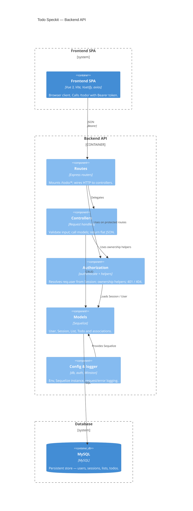

# C4 Level 3 — Backend components

Express app inside `backend/`: routes → controllers → models; cross-cutting auth and config.

**Layout:** `$c4BoundaryInRow="1"` stacks **Frontend SPA** → **Backend API** → **Database** (same vertical idea as the frontend diagram). Preview with a C4-capable Mermaid extension.

**Related:** [ADR-0002](../adr/0002-security-architecture.md) · [auth-patterns.mdc](../../.cursor/rules/auth-patterns.mdc) · [security.mdc](../../.cursor/rules/security.mdc)
