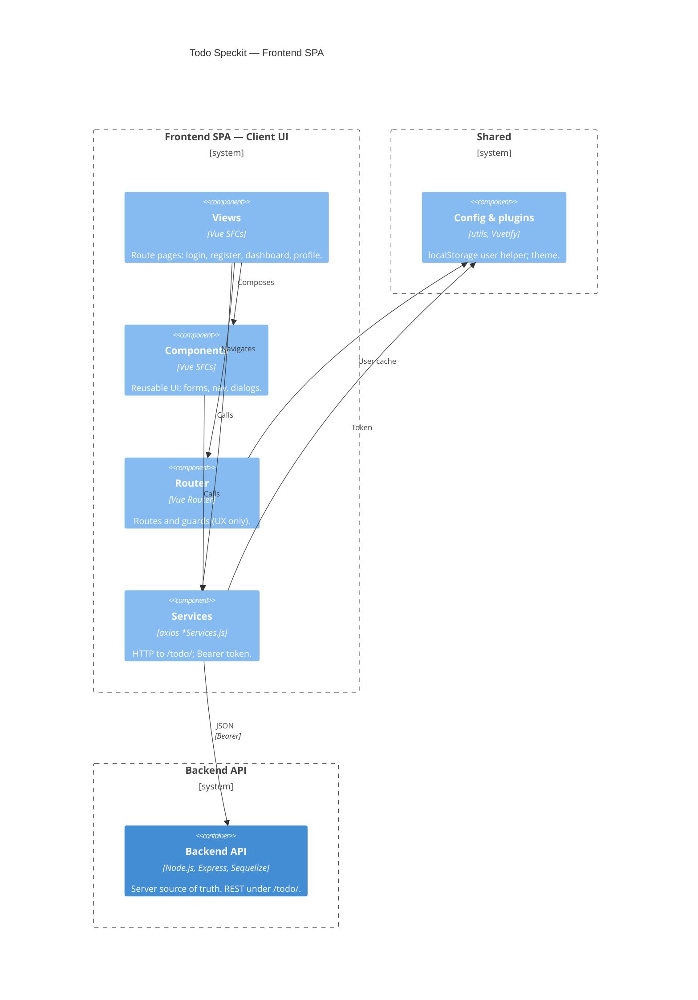

# C4 Level 3 — Frontend components

Vue SPA inside `frontend/src/`: views and components call axios services; router and localStorage support UX only (API remains authoritative).

**Layout:** `$c4BoundaryInRow="2"` places **Client UI** and **Shared** side by side; **Backend API** alone on the next row (underneath). Mermaid cannot set a different boundary count per row, so this is the workable pattern. Preview with a C4-capable Mermaid extension.

**Related:** [frontend-services.mdc](../../.cursor/rules/frontend-services.mdc) · [ui-style-system.mdc](../../.cursor/rules/ui-style-system.mdc)
