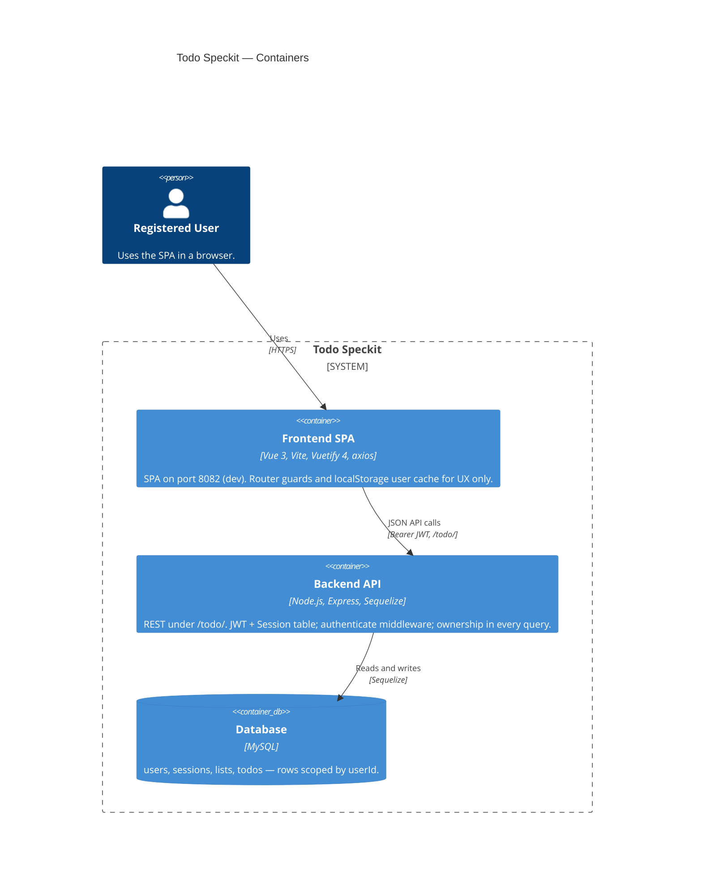

# C4 Level 2 — Containers

Monorepo split: browser SPA talks to a stateless REST API; API owns auth and `userId` scoping; MySQL holds rows.

**Dev ports:** frontend `8082` · backend `3200` · CORS origin must match the SPA.

**Related:** [project-structure.mdc](../../.cursor/rules/project-structure.mdc) · [api.md](../../features/reference/api.md)
