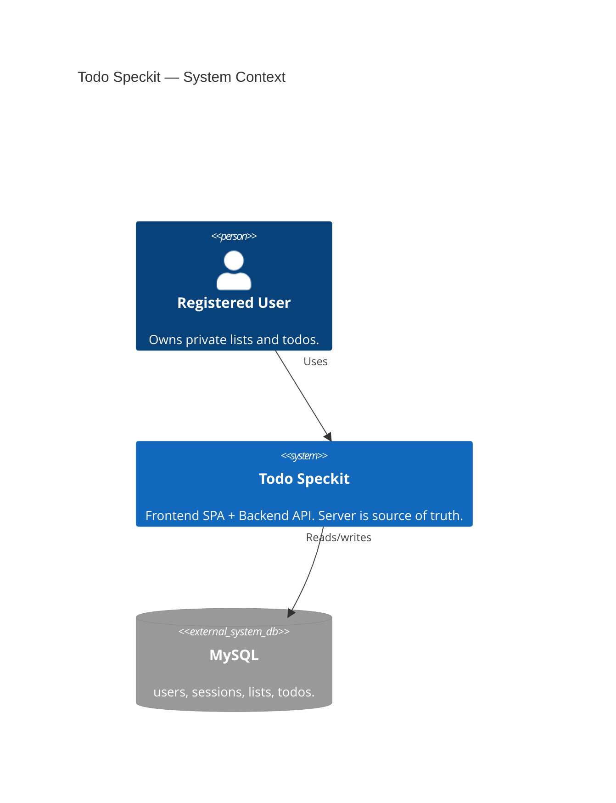

# C4 Level 1 — System context

Todo Speckit: a registered user uses the web app; the app persists private lists and todos in MySQL via the API. No external SaaS dependencies in the teaching model.

Mermaid C4 layout is limited. Keep relationship labels **short**; avoid large `$offsetX` (it often drops text inside boxes). A small negative `$offsetY` lifts labels above the line.

**Related:** [ADR-0001](../adr/0001-client-server-multi-user-architecture.md) · [ADR-0003](../adr/0003-mysql-relational-database.md)
