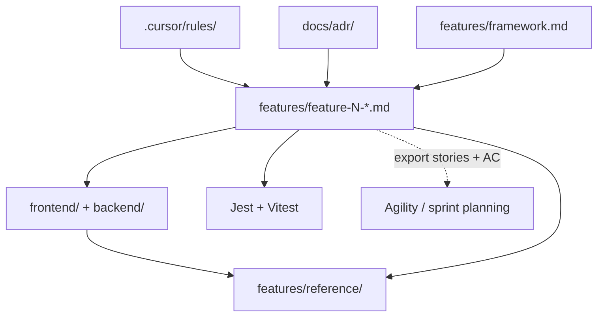

# Todo Speckit — Feature Specifications

Product requirements only — `features/` catalog, framework, and feature specs.

---

# Part 1: Catalog & methodology

<!-- source: features/README.md -->

# README.md

# Feature Specifications

Spec-driven development (SDD) source of truth for the Todo Speckit project.  
No application code may be written unless it maps to a requirement in one of these files.

**Methodology:** [framework.md](./framework.md) — how to write, trace, and ship feature specs.

**Sprints** (timeboxes, iterations, team planning) live in your agile tool — they are **not** part of these specs. One sprint may contain multiple features; one feature may span sprints. Specs describe **what** to build; sprints describe **when** the team works on it.

## Feature catalog

| ID | File | Branch | Depends on |
|----|------|--------|------------|
| 1 | [feature-1-user-auth.md](./feature-1-user-auth.md) | `feature/1-user-auth` | — |
| 2 | [feature-2-todo-list-management.md](./feature-2-todo-list-management.md) | `feature/2-todo-list-management` | Feature 1 |
| 3 | [feature-3-todo-list-item-management.md](./feature-3-todo-list-item-management.md) | `feature/3-todo-list-item-management` | Features 1–2 |
| 4 | [feature-4-user-profile-management.md](./feature-4-user-profile-management.md) | `feature/4-user-profile-management` | Features 1–3 |
| 5 | [feature-5-todo-due-date.md](./feature-5-todo-due-date.md) | `feature/5-todo-due-date` | Features 1–3 |

**Branch roles:** `main` = scaffold-only starter kit · `dev` = integration (branch from `main`, merge features here) · `feature/N-*` = feature implementation (branch from `dev`).

Implement features in dependency order (1 → 2 → 3; 4 and 5 after 3). Features 4 and 5 do not depend on each other.

## Living reference (current integrated state)

After features merge to `dev`, keep these snapshots in sync with the codebase:

| File | Purpose |
|------|---------|
| [reference/README.md](./reference/README.md) | How to maintain reference docs |
| [reference/data-model.md](./reference/data-model.md) | Current database tables and associations |
| [reference/api.md](./reference/api.md) | Current REST API under `/todo/` |

Feature specs define **changes**; reference files describe **what exists now**.

## Implementation order (each feature)

1. Backend models and associations
2. Backend routes, controllers, authorization helpers
3. Backend tests (Jest + supertest)
4. Frontend services (`*Services.js`, axios client)
5. Frontend views and components
6. Frontend tests (Vitest + `@vue/test-utils`)
7. Router updates and manual verification

## Related project docs

- Cursor rules: `.cursor/rules/`
- Architecture decisions: `docs/adr/` — [index](../docs/adr/README.md)
- Living reference: `features/reference/` (data model + API snapshot on `dev`)
- Backend env: `backend/.env` (copy from `backend/.env.example`)
- Test env: `backend/.env.test` (copy from `backend/.env.test.example`)
- UI references (optional): `docs/ui/` — link Figma exports from each feature spec

## Running tests

```bash
npm test                 # from repo root — backend + frontend
npm run test:backend     # Jest
npm run test:frontend    # Vitest
```

## Export rules & specs to PDF

Two PDF exports are available:

| Command | Contents | Output |
|---------|----------|--------|
| `npm run specs:pdf` | **Full** — Cursor rules, ADRs, feature specs, reference | `docs/todo-speckit-specs.pdf` |
| `npm run specs:pdf:features` | **Features only** — catalog, framework, five feature specs | `docs/todo-speckit-features.pdf` |
| `npm run specs:pdf:all` | Both of the above | both PDFs |

```bash
npm install              # once — installs md-to-pdf at repo root
npm run specs:pdf        # full bundle (~60 pages — course / audit)
npm run specs:pdf:features   # requirements only (~25 pages — daily build work)
```

If PDF generation fails with a missing Chrome error, either use installed Google Chrome automatically (macOS) or run the one-time browser download:

```bash
npm run specs:pdf:setup
npm run specs:pdf
```

### Full export (`specs:pdf`)

- `docs/todo-speckit-specs.md` — combined Markdown
- `docs/todo-speckit-specs.pdf` — PDF export

**Included files (in order):**

1. `.cursor/rules/constitution.mdc`
2. `.cursor/rules/project-structure.mdc`
3. `.cursor/rules/api-conventions.mdc`
4. `.cursor/rules/auth-patterns.mdc`
5. `.cursor/rules/frontend-services.mdc`
6. `.cursor/rules/security.mdc`
7. `.cursor/rules/testing-standards.mdc`
8. `.cursor/rules/ui-style-system.mdc`
9. `docs/adr/README.md`
10. `docs/adr/0001-client-server-multi-user-architecture.md`
11. `docs/adr/0002-security-architecture.md`
12. `docs/adr/0003-mysql-relational-database.md`
13. `features/README.md`
14. `features/framework.md`
15. `features/feature-1-user-auth.md` through `feature-5-todo-due-date.md`
16. `features/reference/README.md`, `data-model.md`, `api.md`

### Features-only export (`specs:pdf:features`)

- `docs/todo-speckit-features.md` — combined Markdown
- `docs/todo-speckit-features.pdf` — PDF export

**Included files (in order):**

1. `features/README.md`
2. `features/framework.md`
3. `features/feature-1-user-auth.md` through `feature-5-todo-due-date.md`

Excludes Cursor rules, ADRs, and reference docs — use when reviewing or implementing product requirements only.

Manual alternative (no npm script):

```bash
cat .cursor/rules/constitution.mdc \
    .cursor/rules/project-structure.mdc \
    .cursor/rules/api-conventions.mdc \
    .cursor/rules/auth-patterns.mdc \
    .cursor/rules/frontend-services.mdc \
    .cursor/rules/security.mdc \
    .cursor/rules/testing-standards.mdc \
    .cursor/rules/ui-style-system.mdc \
    docs/adr/README.md \
    docs/adr/0001-client-server-multi-user-architecture.md \
    docs/adr/0002-security-architecture.md \
    docs/adr/0003-mysql-relational-database.md \
    features/README.md \
    features/framework.md \
    features/feature-1-user-auth.md \
    features/feature-2-todo-list-management.md \
    features/feature-3-todo-list-item-management.md \
    features/feature-4-user-profile-management.md \
    features/feature-5-todo-due-date.md \
    features/reference/README.md \
    features/reference/data-model.md \
    features/reference/api.md \
  > /tmp/todo-speckit-specs.md

npx md-to-pdf /tmp/todo-speckit-specs.md
```

Note: the manual `cat` approach leaves YAML frontmatter in `.mdc` files; `npm run specs:pdf` strips it for cleaner PDF output.

<div style="page-break-after: always;"></div>

<!-- source: features/framework.md -->

# framework.md

# Spec-Driven Development Framework

How Todo Speckit writes, traces, and ships **feature specifications**.  
This document is the methodology handbook; individual feature files are the requirements.

**Related:** [Feature catalog](./README.md) · [ADRs](../docs/adr/README.md) · [Living reference](./reference/README.md) · [Constitution](../.cursor/rules/constitution.mdc)

---

## Purpose

Spec-Driven Development (SDD) inverts the usual order: **spec first, code second, tests as proof**.

| Role | Responsibility |
|------|----------------|
| **Feature specs** (`features/feature-N-*.md`) | Authorize *what* to build |
| **Cursor rules** (`.cursor/rules/`) | Constrain *how* to build |
| **Tests** (Jest, Vitest) | Verify spec + implementation match |
| **Reference docs** (`features/reference/`) | Snapshot *what exists now* on `dev` |
| **ADRs** (`docs/adr/`) | Record *why* cross-cutting architecture choices were made |
| **Sprints / timeboxes** (Agility, Jira, etc.) | Plan *when* work happens — **outside** these specs |

No application code may be written unless it maps to an explicit requirement in a feature file (see constitution Principle 1).

---

## Artifact map

```text
.cursor/rules/          ← stack conventions (how)
docs/adr/               ← architecture decisions (why)
features/framework.md   ← this file (process)
features/feature-N-*.md ← product requirements (what)
        ↓
frontend/ + backend/    ← implementation
        ↓
tests/                  ← verification
        ↓
features/reference/     ← integrated snapshot after merge to dev
```



**Specs define changes.** Reference files describe the current integrated product. **Sprints** assign stories to iterations in your agile tool; they are not fields in feature markdown.

---

## Feature spec template

Every new feature uses `features/feature-N-short-name.md` with these sections **in order**. Copy [feature-1-user-auth.md](./feature-1-user-auth.md) as the canonical example.

### Header

```markdown
# Feature: <Human-readable title>

**Feature ID:** N
**Branch pattern:** `feature/N-short-name`
**Depends on:** [Feature X — …](feature-X-….md), …   ← omit if none
**Related:** `features/reference/…`, [ADR-NNNN](../docs/adr/NNNN-title.md)   ← optional
```

- **Feature ID** — sequential integer; never reuse a retired ID.
- **Branch pattern** — one Git branch per feature, branched from `dev`, merged back to `dev` (never `main`).
- **Depends on** — link to feature files whose code must already be on `dev`.

### Required sections

| Section | Purpose |
|---------|---------|
| **User Stories** | `US-N.n` backlog items (feature N, story n) |
| **System Requirements** | Cross-cutting behavior, validation, security |
| **API Requirements** | Endpoints, payloads, status codes (if applicable) |
| **Screen Requirements** | Routes, views, UX (if applicable) |
| **Data Model Requirements** | Tables, columns, associations (if applicable) |
| **Acceptance Criteria (Gherkin)** | Testable `Given / When / Then` scenarios |
| **Test Coverage Map** | Each scenario → test file / area |
| **Out of Scope** | Explicit deferrals with links to other feature files |

Optional sections used in this repo when needed: **Data Ownership & Isolation**, **Definition of Done**, **Delivered to Feature X** (handoff notes).

### User story format

```markdown
### US-1.1: Short title
**As a** …
**I want to** …
**So that** …
```

Use **As a** or **As the** (for system-level stories). Number stories **`US-<feature-id>.<story-number>`** — e.g. Feature 2’s third story is `US-2.3`. Story numbers restart at `.1` in each feature file.

### Gherkin format

Group scenarios under a `###` heading that includes the **story ID** and title (same as the user story):

```markdown
### US-1.1 — Registration

#### Scenario: Descriptive name
* **Given** …
* **When** …
* **Then** …
* **And** …
```

Each `### US-N.n` block under **Acceptance Criteria** owns the scenarios for that user story. One story may have many scenarios; do not mix scenarios from different stories under one heading.

Every scenario must appear in the **Test Coverage Map** and have at least one automated test before the feature is done.

---

## Traceability

| Spec artifact | Git | Tests | Agility export |
|---------------|-----|-------|----------------|
| Feature file | `feature/N-*` branch | — | Epic (Portfolio Item) |
| `US-N.n` | — | — | Story |
| `#### Scenario:` | — | Jest / Vitest `it("…")` | Test (acceptance criteria) |
| Stable refs | — | — | `TS-F{N}-US{N}.{n}`, `TS-F{N}-AC{nnn}` |

Export backlog: `npm run agility:export` or `npm run agility:push` (see [docs/agility-import/README.md](../docs/agility-import/README.md)).

---

## Test traceability

Tests must link back to the spec in three layers:

```text
feature-3-todo-list-item-management.md
  └── US-3.1 — Add tasks to a list
        └── Scenario: User adds a todo to the selected list
              └── backend/tests/todos.test.js → it("User adds a todo…")
```

### File header

Every feature test file starts with:

```javascript
/**
 * Feature 3 — Todo List Item Management
 * Spec: features/feature-3-todo-list-item-management.md
 */
```

Harness-only files (`app.test.js`, `App.test.js`) are exempt — they verify the test setup, not product behavior.

### Nested `describe` blocks

```javascript
describe("Feature 3 — Todo API", () => {
  describe("US-3.1 — Add tasks to a list", () => {
    it("User adds a todo to the selected list", async () => { /* … */ });
    it("User adds a todo with an empty title", async () => { /* … */ });
  });
});
```

- **Outer `describe`** — feature name (matches spec title).
- **Inner `describe`** — `US-N.n` + story title (matches AC `###` heading).
- **`it` name** — exact Gherkin **Scenario** title from the spec.

### Test Coverage Map (in each feature spec)

The map is the authoritative index. Prefer this column layout:

| Story | Scenario | Test file | Test name |
|-------|----------|-----------|-----------|
| US-3.1 | User adds a todo to the selected list | `backend/tests/todos.test.js` | `it("User adds a todo to the selected list")` |
| US-3.1 | User adds a todo with an empty title | `frontend/tests/Dashboard.test.js` | `it("User adds a todo with an empty title")` |

### Auditing coverage

```bash
# Find all tests for a story
rg "US-3.1" features/ backend/tests frontend/tests

# Find a scenario across spec and tests
rg "User adds a todo with an empty title" features/ backend/tests frontend/tests
```

Every `#### Scenario` in the spec must have ≥1 matching `it`. Every feature `it` must trace to a scenario.

---

## Architecture Decision Records (ADRs)

ADRs live in [`docs/adr/`](../docs/adr/) and answer **why** — not **what** (feature specs) or **how** (Cursor rules).

| Write an ADR when… | Use instead… |
|--------------------|--------------|
| Choosing client vs server, auth model, DB strategy | Feature spec for product behavior |
| Documenting tradeoffs and rejected alternatives | Cursor rule for ongoing patterns |
| A decision spans multiple features | Reference doc for current API/schema snapshot |

**Workflow:** propose ADR → set status `Accepted` → link from affected feature headers → encode outcome in `.cursor/rules/` if it becomes a pattern.

See [docs/adr/README.md](../docs/adr/README.md) for the template and index.

---

## Workflow per feature

### 1. Write or update the spec first

Add `features/feature-N-….md` before implementation. If behavior is not in the spec, do not implement it (or update the spec first).

### 2. Branch from `dev`

```bash
git checkout dev && git pull
git checkout -b feature/N-short-name
```

### 3. Implement in layer order

1. Backend models and associations  
2. Backend routes, controllers, authorization helpers  
3. Backend tests (Jest + supertest)  
4. Frontend services (`*Services.js`, axios client)  
5. Frontend views and components  
6. Frontend tests (Vitest + `@vue/test-utils`)  
7. Router updates and manual verification  

Work in **atomic steps** — one layer per commit when possible (constitution Principle 4).

### 4. Map tests to Gherkin

Fill the **Test Coverage Map** as you add tests. No `expect(true).toBe(true)`; use edge cases from the spec.

### 5. Merge to `dev`

When every user story is implemented and every Gherkin scenario has a test:

```bash
git checkout dev && git merge feature/N-short-name
```

### 6. Update living reference

If tables or API endpoints changed, update [reference/data-model.md](./reference/data-model.md) and [reference/api.md](./reference/api.md) at merge time.

---

## When to add vs edit

| Situation | Action |
|-----------|--------|
| New capability | New `feature-(N+1)-….md` + row in [README](./README.md) catalog |
| Cross-cutting architecture choice | New `docs/adr/NNNN-….md` + link from feature specs |
| Clarify unmerged spec | Edit the feature file in place |
| Change already on `dev` | New feature file for the delta, or amend spec only if team agrees to treat spec as living |
| “What exists now?” | Update `features/reference/` — not the feature spec alone |

Feature specs are **deltas**; reference docs are **current state**.

---

## Features vs sprints

| | Feature spec | Sprint / iteration |
|--|--------------|-------------------|
| **Question** | What must the product do? | When will the team work on it? |
| **Lives in** | `features/feature-N-*.md` | Agility, Jira, etc. |
| **Granularity** | One file per shippable capability | Any grouping of stories |
| **This repo** | Source of truth for code + tests | Assigned after export/import |

Example: Feature 2 (lists) and Feature 4 (profile) can ship in the same sprint, or Feature 3 can span two sprints — specs stay the same either way.

---

## Adding Feature N+1 (checklist)

- [ ] Pick next sequential **Feature ID** and filename `feature-N-kebab-name.md`
- [ ] Fill header: branch pattern, **Depends on** links
- [ ] Complete user stories, system/API/screen/data sections as applicable
- [ ] Write Gherkin acceptance criteria for all behavior
- [ ] Add **Test Coverage Map** before coding
- [ ] Document **Out of Scope** with links to other features
- [ ] Add row to [features/README.md](./README.md) catalog
- [ ] After merge: update `features/reference/` if schema or API changed

---

## Cursor and AI usage

- Rules in `.cursor/rules/` apply automatically; they do not replace feature specs.
- In prompts, `@`-mention one feature file and **one slice** (e.g. “implement Data Model Requirements only”).
- If the AI proposes behavior not in the spec, update the spec first or reject the change (constitution Principle 6).

---

## Anti-patterns

| Do not | Do instead |
|--------|------------|
| Code first, spec later | Spec merge before or with first implementation PR |
| Put sprint numbers in feature files | Plan sprints in the agile tool |
| Skip Test Coverage Map | Map every Gherkin scenario before marking done |
| Change `reference/` without a spec | Spec authorizes the delta; reference reflects merge |
| Implement on `main` | `feature/N-*` → `dev` only |
| One giant “build the feature” prompt | Layer-by-layer micro-steps |

---

## Who should read what

Documentation volume is intentional for SDD teaching, but not every artifact is needed for every task.

| Role / task | Read |
|-------------|------|
| Implementing a feature slice | That feature's `feature-N-*.md` only |
| Onboarding to the stack | `.cursor/rules/` + relevant ADR |
| Understanding architecture choices | `docs/adr/` |
| "What exists on `dev`?" | `features/reference/` |
| Course lead / audit bundle | Full PDF (`npm run specs:pdf`) |
| Product requirements review | Features PDF (`npm run specs:pdf:features`) |

**Rule:** specs authorize *what*; rules constrain *how*; ADRs explain *why*; reference snapshots *current state*.

---

## Exports

| Command | Output |
|---------|--------|
| `npm run specs:pdf` | **Full** — rules + ADRs + specs + reference → `docs/todo-speckit-specs.pdf` |
| `npm run specs:pdf:features` | **Features only** — catalog + framework + feature specs → `docs/todo-speckit-features.pdf` |
| `npm run specs:pdf:all` | Both PDFs above |
| `npm run agility:export` | CSV backlog for Agility Excel import |
| `npm run agility:push` | Push epics, stories, tests via Agility API |

PDF include order: see [README](./README.md#export-rules--specs-to-pdf).


<div style="page-break-after: always;"></div>


# Part 2: Feature requirements

<!-- source: features/feature-1-user-auth.md -->

# feature-1-user-auth.md

# Feature: User Authentication & Session Management

**Feature ID:** 1
**Branch pattern:** `feature/1-user-auth`
**Related:** [ADR-0001 — Client–server multi-user architecture](../docs/adr/0001-client-server-multi-user-architecture.md), [ADR-0002 — Security architecture](../docs/adr/0002-security-architecture.md)

---

## User Stories

### US-1.1: Register an account
**As a** new user  
**I want to** create an account with my name, email, username, and password  
**So that** I can sign in and manage my own private todo lists

### US-1.2: Sign in
**As a** registered user  
**I want to** sign in with my username and password  
**So that** I can access the application dashboard securely

### US-1.3: Stay signed in across page loads
**As a** signed-in user  
**I want** my session to persist in the browser  
**So that** I do not have to sign in again every time I refresh the page

### US-1.4: Sign out
**As a** signed-in user  
**I want to** sign out  
**So that** no one else can use my account on a shared device

### US-1.5: Block unauthenticated access
**As the** application  
**I want to** require a valid session for all non-auth screens  
**So that** users can only see and modify their own data

---

## System Requirements

*   Users authenticate with **username** + **password** (not email-only login).
*   Registration collects: first name, last name, email, username, password.
*   Passwords are hashed with **bcrypt** (`SALT_ROUNDS = 10`) before persistence; hashes are never returned by the API.
*   Sessions use a **JWT + Session table** pattern: token stored server-side; client sends `Authorization: Bearer <token>`.
*   Session lifetime: **24 hours** from creation.
*   Reuse a non-expired session for the same user on login when one already exists.
*   Default role for new users: `worker`.
*   **Data ownership foundation:** every authenticated request must resolve to exactly one user via `req.user.id` from the session token. Later features scope all lists and todo items to this ID.
*   **Frontend email validation:** registration uses shared `emailRules` from `frontend/src/config/validation.js` — required plus regex format check (`/^[^\s@]+@[^\s@]+\.[^\s@]+$/`); invalid format message: **"Enter a valid email address."**

---

## Data Ownership & Isolation (foundation)

Feature 1 establishes identity; Features 2–3 enforce per-user data boundaries.

*   Each user account is a separate tenant boundary for todo lists and items.
*   No API in this feature returns another user's profile or session.
*   Later features must never expose lists or todos across users — not in list responses, detail views, or error messages that confirm another user's resource exists.

---

## API Requirements

| Method | Endpoint | Auth | Purpose |
|--------|----------|------|---------|
| `POST` | `/todo/register` | No | Create a new user account |
| `POST` | `/todo/login` | No | Authenticate and return session payload |
| `POST` | `/todo/logout` | Yes | Invalidate current session token |

**Login / register success response** (flat JSON, no envelope):
```json
{
  "userId": 1,
  "username": "jdoe",
  "email": "jdoe@example.com",
  "fName": "Jane",
  "lName": "Doe",
  "role": "worker",
  "token": "<jwt>"
}
```

**Error response:** `{ "message": "Human-readable explanation." }` with appropriate HTTP status.

---

## Screen Requirements

### [View: Login Page] — route name `login`
*   Full-screen auth layout (no `MenuBar`).
*   Fields: username, password.
*   Primary action: **Sign in** (`v-btn`, shows `:loading` while request is in flight).
*   Link or button to navigate to registration.
*   Inline error via `<v-alert type="error">` on failed login.

### [View: Register Page] — route name `register`
*   Full-screen auth layout (no `MenuBar`).
*   Fields: first name, last name, email, username, password, confirm password.
*   Email field uses shared `emailRules` from `frontend/src/config/validation.js` (required + regex format).
*   Primary action: **Create account**.
*   Link or button to navigate to login.
*   Client-side validation before API call; server errors shown via `<v-alert type="error">`.

### [View: Dashboard placeholder] — route name `home`
*   Minimal protected landing page shown after successful login (full dashboard built in Feature 2).
*   Displays a welcome message using the user's first name.
*   **No `MenuBar`** in Feature 1 — auth pages and this placeholder use a full-screen layout only.
*   **Sign out** button on this page (standalone `v-btn`; removed from page content when `MenuBar` is added in Feature 2).

---

## Data Model Requirements

### `users` table
| Field | Type | Rules |
|-------|------|-------|
| `id` | INTEGER PK | Auto-increment |
| `fName` | STRING | Required |
| `lName` | STRING | Required |
| `email` | STRING | Required, unique |
| `username` | STRING(100) | Required, unique; stored lowercase |
| `password` | STRING(255) | Required; bcrypt hash only |
| `role` | STRING(20) | Default `worker` |

### `sessions` table
| Field | Type | Rules |
|-------|------|-------|
| `id` | INTEGER PK | Auto-increment |
| `token` | STRING | Required |
| `email` | STRING | Required |
| `expirationDate` | DATE | Required |
| `userId` | INTEGER FK | Required, references `users.id` |

---

## Acceptance Criteria (Gherkin)

### US-1.1 — Registration

#### Scenario: User registers with valid information
*   **Given** I am on the registration page
*   **When** I enter valid first name, last name, email, username, password, and matching confirm password
*   **And** I submit the form
*   **Then** the API returns `201` with a user payload including `userId`, `username`, `email`, `token`, and `role`
*   **And** my user record is stored in the database with a bcrypt password hash
*   **And** I am redirected to the home page
*   **And** my session is stored in `localStorage` under the key `user`

#### Scenario: User submits registration with missing email
*   **Given** I am on the registration page
*   **When** I leave the email field empty
*   **And** I submit the form
*   **Then** inline validation blocks the request
*   **And** I see the message **"Email is required."**
*   **And** no API request is sent

#### Scenario: User submits registration with invalid email format
*   **Given** I am on the registration page
*   **When** I enter a value that is not a valid email address (e.g. `notanemail`)
*   **And** I submit the form
*   **Then** inline validation blocks the request
*   **And** I see the message **"Enter a valid email address."**
*   **And** no API request is sent

#### Scenario: User submits registration with missing username
*   **Given** I am on the registration page
*   **When** I leave the username field empty
*   **And** I submit the form
*   **Then** inline validation blocks the request
*   **And** I see the message **"Username is required."**
*   **And** no API request is sent

#### Scenario: User submits registration with password too short
*   **Given** I am on the registration page
*   **When** I enter a password with fewer than 8 characters
*   **And** I submit the form
*   **Then** inline validation blocks the request
*   **And** I see the message **"Password must be at least 8 characters."**

#### Scenario: User submits registration with mismatched passwords
*   **Given** I am on the registration page
*   **When** password and confirm password do not match
*   **And** I submit the form
*   **Then** inline validation blocks the request
*   **And** I see the message **"Passwords do not match."**

#### Scenario: User registers with a duplicate username
*   **Given** a user with username `jdoe` already exists
*   **When** I submit registration with username `jdoe`
*   **Then** the API returns `400` with `{ "message": "Username is already taken." }`
*   **And** the error is displayed in a `<v-alert type="error">`

#### Scenario: User registers with a duplicate email
*   **Given** a user with email `jane@example.com` already exists
*   **When** I submit registration with email `jane@example.com`
*   **Then** the API returns `400` with `{ "message": "Email is already registered." }`
*   **And** the error is displayed in a `<v-alert type="error">`

---

### US-1.2 — Sign in

#### Scenario: User signs in with valid credentials
*   **Given** I am on the login page
*   **And** a registered user exists with username `jdoe` and a known password
*   **When** I enter username `jdoe` and the correct password
*   **And** I click **Sign in**
*   **Then** the API returns `200` with a payload containing `userId`, `username`, `token`, and `role`
*   **And** a session row is created or reused in the database
*   **And** I am redirected to the home page
*   **And** my session is stored in `localStorage` under the key `user`

#### Scenario: User signs in with invalid password
*   **Given** I am on the login page
*   **And** a registered user exists with username `jdoe`
*   **When** I enter username `jdoe` and an incorrect password
*   **And** I click **Sign in**
*   **Then** the API returns `401` with `{ "message": "Invalid username or password." }`
*   **And** I remain on the login page
*   **And** the error is displayed in a `<v-alert type="error">`

#### Scenario: User signs in with missing username
*   **Given** I am on the login page
*   **When** I leave the username field empty
*   **And** I click **Sign in**
*   **Then** inline validation blocks the request
*   **And** I see the message **"Username is required."**
*   **And** no API request is sent

#### Scenario: User signs in with missing password
*   **Given** I am on the login page
*   **When** I leave the password field empty
*   **And** I click **Sign in**
*   **Then** inline validation blocks the request
*   **And** I see the message **"Password is required."**
*   **And** no API request is sent

---

### US-1.3 — Stay signed in across page loads

#### Scenario: Signed-in user visits login page
*   **Given** I have a valid session in `localStorage`
*   **When** I navigate to the login page
*   **Then** I am redirected to the home page

#### Scenario: API request includes session token
*   **Given** I am signed in
*   **When** the frontend makes an authenticated API request
*   **Then** the request includes header `Authorization: Bearer <token>`

#### Scenario: Protected API request succeeds with a valid session
*   **Given** I am signed in as user A
*   **And** user B also exists
*   **When** I send an authenticated `GET /todo/lists` request
*   **Then** the API returns `200`
*   **And** only lists owned by user A are returned

#### Scenario: Expired or invalid session token
*   **Given** I am signed in with an expired or revoked token
*   **When** the frontend makes an authenticated API request
*   **Then** the API returns `401` with an unauthorized message
*   **And** `localStorage` key `user` is cleared
*   **And** I am redirected to the login page

---

### US-1.4 — Sign out

#### Scenario: User signs out
*   **Given** I am signed in on the home page
*   **When** I click **Sign out**
*   **Then** the API invalidates my session token on the server
*   **And** `localStorage` key `user` is removed
*   **And** I am redirected to the login page

---

### US-1.5 — Block unauthenticated access

#### Scenario: Unauthenticated user accesses a protected route
*   **Given** I have no session in `localStorage`
*   **When** I navigate directly to the home page
*   **Then** I am redirected to the login page

---

## Test Coverage Map

Each scenario above must map to at least one automated test.

| Story | Scenario | Test file | Test name |
|-------|----------|-----------|-----------|
| US-1.1 | User registers with valid information | `backend/tests/auth.test.js` | `User registers with valid information` |
| US-1.1 | User submits registration with missing email | `backend/tests/auth.test.js` | `User submits registration with missing email` |
| US-1.1 | User submits registration with invalid email format | `frontend/tests/Register.test.js` | `User submits registration with invalid email format` |
| US-1.1 | User submits registration with missing username | `frontend/tests/Register.test.js` | `User submits registration with missing username` |
| US-1.1 | User submits registration with password too short | `backend/tests/auth.test.js`, `frontend/tests/Register.test.js` | `User submits registration with password too short` |
| US-1.1 | User submits registration with mismatched passwords | `frontend/tests/Register.test.js` | `User submits registration with mismatched passwords` |
| US-1.1 | User registers with a duplicate username | `backend/tests/auth.test.js` | `User registers with a duplicate username` |
| US-1.1 | User registers with a duplicate email | `backend/tests/auth.test.js` | `User registers with a duplicate email` |
| US-1.2 | User signs in with valid credentials | `backend/tests/auth.test.js` | `User signs in with valid credentials` |
| US-1.2 | User signs in with invalid password | `backend/tests/auth.test.js`, `frontend/tests/Login.test.js` | `User signs in with invalid password` |
| US-1.2 | User signs in with missing username | `backend/tests/auth.test.js`, `frontend/tests/Login.test.js` | `User signs in with missing username` |
| US-1.2 | User signs in with missing password | `backend/tests/auth.test.js`, `frontend/tests/Login.test.js` | `User signs in with missing password` |
| US-1.3 | Signed-in user visits login page | `frontend/tests/router.test.js` | `Signed-in user visits login page` |
| US-1.3 | API request includes session token | `backend/tests/authenticate.test.js` | `API request includes session token` |
| US-1.3 | Protected API request succeeds with a valid session | `backend/tests/authenticate.test.js` | `Protected API request succeeds with a valid session` |
| US-1.3 | Expired or invalid session token | `backend/tests/authenticate.test.js` | `Expired or invalid session token` |
| US-1.4 | User signs out | `backend/tests/auth.test.js` | `User signs out` |
| US-1.5 | Unauthenticated user accesses a protected route | `backend/tests/authenticate.test.js`, `frontend/tests/router.test.js` | `Unauthenticated user accesses a protected route` |

---

## Out of Scope

*   Password reset (`POST /todo/reset-password`)
*   Email verification
*   OAuth / social login
*   Admin user management
*   Full todo dashboard (Feature 2)

<div style="page-break-after: always;"></div>

<!-- source: features/feature-2-todo-list-management.md -->

# feature-2-todo-list-management.md

# Feature: Todo List Management

**Feature ID:** 2
**Branch pattern:** `feature/2-todo-list-management`
**Depends on:** [Feature 1 — User Authentication](feature-1-user-auth.md)

---

## User Stories

### US-2.1: Create todo lists
**As a** signed-in user  
**I want to** create named todo lists (e.g. "Work", "Groceries")  
**So that** I can organize tasks into separate groups

### US-2.2: View my lists
**As a** signed-in user  
**I want to** see all of my todo lists in a sidebar  
**So that** I can see what groups I have created

### US-2.3: Select a list
**As a** signed-in user  
**I want to** select a list from the sidebar  
**So that** I can focus on one group at a time (todo items added in Feature 3)

### US-2.4: Rename and delete lists
**As a** signed-in user  
**I want to** rename or delete a todo list  
**So that** I can keep my workspace organized

### US-2.5: Private lists only
**As a** signed-in user  
**I want** my lists visible only to me  
**So that** other users cannot read or modify my list names

---

## System Requirements

*   All list endpoints require a valid session (`authenticate` middleware).
*   A **list** belongs to exactly one user for its entire lifetime; ownership never changes.
*   Every database read, update, and delete must include `userId: req.user.id` in the `where` clause.
*   On create, set `userId` from `req.user.id` only — **ignore or strip** any `userId` sent in the request body.
*   List names are trimmed before save; empty strings are rejected.
*   Lists are ordered alphabetically by name.
*   This feature delivers **list CRUD and sidebar UI only** — todo item UI and API are defined in Feature 3.

---

## Data Ownership & Isolation

Each user owns their lists exclusively. Another authenticated user must not be able to view, rename, or delete them.

| Rule | Requirement |
|------|-------------|
| **Read scope** | `GET /todo/lists` returns only lists where `userId = req.user.id`. |
| **Write scope** | `PUT` and `DELETE` apply only when the list row matches both `id` and `req.user.id`. |
| **Create scope** | New lists are always owned by the authenticated user. |
| **Cross-user access** | If a list belongs to another user, respond with `404` — never `403` (do not confirm the list exists). |
| **UI scope** | The sidebar shows only lists returned by `GET /todo/lists` for the signed-in user. |
| **Implementation** | Use a shared helper (e.g. `getAccessibleListOrNull(req, listId)`) in `app/authorization/` — do not duplicate scope logic in controllers. |

---

## API Requirements

| Method | Endpoint | Auth | Purpose |
|--------|----------|------|---------|
| `GET` | `/todo/lists` | Yes | Fetch all lists for the authenticated user |
| `POST` | `/todo/lists` | Yes | Create a new list |
| `PUT` | `/todo/lists/:listId` | Yes | Rename a list |
| `DELETE` | `/todo/lists/:listId` | Yes | Delete a list owned by the caller |

All endpoints return **only data owned by the authenticated user**. Cross-user access attempts return `404`.

**Create list request body:**
```json
{ "name": "Groceries" }
```

**List success response** (`200` / `201`):
```json
{
  "id": 1,
  "name": "Groceries",
  "userId": 42,
  "createdAt": "2026-07-02T12:00:00.000Z",
  "updatedAt": "2026-07-02T12:00:00.000Z"
}
```

**Error response:** `{ "message": "Human-readable explanation." }` with appropriate HTTP status.  
**Not found / not owned:** `404` (do not use `403`).

---

## Screen Requirements

### [View: Application Dashboard] — route name `home`
Replaces the Feature 1 placeholder home page.

**Layout:** split screen using Vuetify grids (`<v-row>`).

| Column | Breakpoint | Contents (this feature) |
|--------|------------|------------------------|
| Sidebar | `cols="12" md="4"` | List management pane |
| Main | `cols="12" md="8"` | Placeholder for Feature 3 todo items |

**Sidebar**
*   Heading: **My Lists**
*   `[+ New List]` button opens a `<v-dialog>` with a name `<v-text-field>` and **Create** / **Cancel** actions.
*   Clickable list of list names; active list is visually highlighted.
*   Each list row has a **rename** icon (opens a `<v-dialog>` pre-filled with the current name; **Save** / **Cancel**) and a **delete** icon (opens a confirmation `<v-dialog>`).
*   **Empty state:** **"No lists yet. Create your first list."** when the user has zero lists.

**Main panel (placeholder — Feature 2)**
*   When a list is selected: heading shows the list name and message **"Todo items will appear here in a later feature."**
*   When no list is selected: **"Select a list"**
*   **Loading state:** skeleton or progress indicator while lists are fetching.
*   **Error state:** `<v-alert type="error">` for API failures.

**App chrome**
*   Introduce `MenuBar` in this feature (not present in Feature 1): signed-in user's name and **Sign out**.
*   `MenuBar` is hidden on login and register routes.

---

## Data Model Requirements

### `lists` table
| Field | Type | Rules |
|-------|------|-------|
| `id` | INTEGER PK | Auto-increment |
| `name` | STRING | Required; max 100 chars |
| `userId` | INTEGER FK | Required; references `users.id`; set from `req.user.id` on create |
| `createdAt` | DATE | Sequelize timestamps |
| `updatedAt` | DATE | Sequelize timestamps |

### Associations (in `models/index.js`)
*   `User hasMany List`
*   `List belongsTo User`

---

## Acceptance Criteria (Gherkin)

### US-2.1 — Create todo lists

#### Scenario: User creates a new list
*   **Given** I am signed in on the dashboard
*   **When** I click **+ New List**
*   **And** I enter list name `Groceries`
*   **And** I confirm the dialog
*   **Then** the API returns `201` with a list object containing `id`, `name`, and `userId`
*   **And** the returned `userId` matches my authenticated user ID
*   **And** `Groceries` appears in the sidebar
*   **And** `Groceries` becomes the selected list
*   **And** the main panel heading shows `Groceries`

#### Scenario: User creates a list with an empty name
*   **Given** I am signed in on the dashboard
*   **When** I open the new list dialog
*   **And** I leave the name field empty or whitespace only
*   **And** I attempt to confirm
*   **Then** inline validation blocks the request
*   **And** I see the message **"List name is required."**
*   **And** no API request is sent

#### Scenario: User creates a list with a name that is too long
*   **Given** I am signed in on the dashboard
*   **When** I submit a list name longer than 100 characters
*   **Then** the API returns `400` with `{ "message": "List name must be 100 characters or fewer." }`
*   **And** the error is displayed in a `<v-alert type="error">`

---

### US-2.2 — View my lists

#### Scenario: Dashboard loads with existing lists
*   **Given** I am signed in
*   **And** I own lists `Work` and `Personal`
*   **When** I navigate to the dashboard
*   **Then** both lists appear in the sidebar
*   **And** the first list is selected by default
*   **And** the main panel shows that list's name

#### Scenario: User has no lists
*   **Given** I am signed in
*   **And** I have no lists
*   **When** I navigate to the dashboard
*   **Then** I see **"No lists yet. Create your first list."**
*   **And** the main panel shows **"Select a list"**

#### Scenario: User cannot see another user's lists
*   **Given** user B owns list `Secret Project`
*   **And** I am signed in as user A
*   **When** I request `GET /todo/lists`
*   **Then** the response contains only lists owned by user A
*   **And** `Secret Project` is not in the response
*   **And** my sidebar does not show `Secret Project`

---

### US-2.3 — Select a list

#### Scenario: User selects a different list
*   **Given** I am signed in
*   **And** I own lists `Work` and `Personal`
*   **When** I click `Personal` in the sidebar
*   **Then** `Personal` is highlighted as the active list
*   **And** the main panel heading shows `Personal`

---

### US-2.4 — Rename and delete lists

#### Scenario: User renames a list
*   **Given** I am signed in
*   **And** I own a list named `Groceries`
*   **When** I rename it to `Shopping`
*   **Then** the API returns `200` with the updated list object
*   **And** the sidebar shows `Shopping` instead of `Groceries`

#### Scenario: User deletes a list
*   **Given** I am signed in
*   **And** I own a list named `Groceries`
*   **When** I delete the list and confirm the dialog
*   **Then** the API returns `200` or `204`
*   **And** the list is removed from the sidebar
*   **And** another owned list is selected if one exists

---

### US-2.5 — Private lists only

#### Scenario: User attempts to rename another user's list
*   **Given** I am signed in as user A
*   **And** a list exists that belongs to user B
*   **When** I send `PUT /todo/lists/:listId` with user B's list ID and body `{ "name": "Hijacked" }`
*   **Then** the API returns `404` with `{ "message": "List with id=<id> not found." }`
*   **And** user B's list name is unchanged in the database

#### Scenario: User attempts to delete another user's list
*   **Given** I am signed in as user A
*   **And** a list exists that belongs to user B
*   **When** I send `DELETE /todo/lists/:listId` with user B's list ID
*   **Then** the API returns `404` with `{ "message": "List with id=<id> not found." }`
*   **And** user B's list still exists

#### Scenario: Client cannot assign a list to another user on create
*   **Given** I am signed in as user A
*   **When** I send `POST /todo/lists` with body `{ "name": "Groceries", "userId": 999 }` where user `999` is a different user
*   **Then** the API returns `201` with a list owned by user A
*   **And** the saved `userId` is user A's ID, not `999`

#### Scenario: Unauthenticated user accesses the dashboard
*   **Given** I have no session in `localStorage`
*   **When** I navigate to the dashboard
*   **Then** I am redirected to the login page

#### Scenario: Unauthenticated API request to lists
*   **Given** I have no valid session token
*   **When** I request `GET /todo/lists`
*   **Then** the API returns `401` with an unauthorized message

---

## Test Coverage Map

| Story | Scenario | Test file | Test name |
|-------|----------|-----------|-----------|
| US-2.1 | User creates a new list | `backend/tests/lists.test.js`, `frontend/tests/Dashboard.test.js` | `User creates a new list` |
| US-2.1 | User creates a list with an empty name | `backend/tests/lists.test.js`, `frontend/tests/Dashboard.test.js` | `User creates a list with an empty name` |
| US-2.1 | User creates a list with a name that is too long | `backend/tests/lists.test.js` | `User creates a list with a name that is too long` |
| US-2.2 | Dashboard loads with existing lists | `backend/tests/lists.test.js`, `frontend/tests/Dashboard.test.js` | `Dashboard loads with existing lists` |
| US-2.2 | User has no lists | `frontend/tests/Dashboard.test.js` | `User has no lists` |
| US-2.2 | User cannot see another user's lists | `backend/tests/lists.test.js` | `User cannot see another user's lists` |
| US-2.3 | User selects a different list | `backend/tests/lists.test.js`, `frontend/tests/Dashboard.test.js` | `User selects a different list` |
| US-2.4 | User renames a list | `backend/tests/lists.test.js`, `frontend/tests/Dashboard.test.js` | `User renames a list` |
| US-2.4 | User deletes a list | `backend/tests/lists.test.js`, `frontend/tests/Dashboard.test.js` | `User deletes a list` |
| US-2.5 | User attempts to rename another user's list | `backend/tests/lists.test.js` | `User attempts to rename another user's list` |
| US-2.5 | User attempts to delete another user's list | `backend/tests/lists.test.js` | `User attempts to delete another user's list` |
| US-2.5 | Client cannot assign a list to another user on create | `backend/tests/lists.test.js` | `Client cannot assign a list to another user on create` |
| US-2.5 | Unauthenticated API request to lists | `backend/tests/lists.test.js` | `Unauthenticated API request to lists` |

---

## Out of Scope

*   Todo items (see `features/feature-3-todo-list-item-management.md`)
*   `MenuBar` beyond basic sign-out (full nav deferred if not needed)
*   Drag-and-drop list reordering
*   Sharing lists with other users

---

## Delivered to Feature 3

The following are intentionally deferred to the next feature spec:

*   `todos` table and associations
*   Main-panel todo list UI (add, complete, edit, delete items)
*   `GET/POST /todo/lists/:listId/todos` and `PUT/DELETE /todo/todos/:id`

<div style="page-break-after: always;"></div>

<!-- source: features/feature-3-todo-list-item-management.md -->

# feature-3-todo-list-item-management.md

# Feature: Todo List Item Management

**Feature ID:** 3
**Branch pattern:** `feature/3-todo-list-item-management`
**Depends on:** [Feature 1 — User Authentication](feature-1-user-auth.md), [Feature 2 — Todo List Management](feature-2-todo-list-management.md)

---

## User Stories

### US-3.1: Add tasks to a list
**As a** signed-in user  
**I want to** add todo items to the currently selected list  
**So that** I can track what needs to be done in that context

### US-3.2: View tasks in a list
**As a** signed-in user  
**I want to** see all items in the selected list  
**So that** I know what work belongs to that group

### US-3.3: Complete tasks
**As a** signed-in user  
**I want to** mark todos as complete or incomplete  
**So that** I can track my progress

### US-3.4: Edit and remove tasks
**As a** signed-in user  
**I want to** edit or delete individual todos  
**So that** I can keep my lists accurate

### US-3.5: Private items only
**As a** signed-in user  
**I want** my todo items visible only to me  
**So that** other users cannot read or modify my tasks

### US-3.6: Lists carry their items
**As a** signed-in user  
**I want** deleting a list to remove its todo items  
**So that** I do not leave orphaned tasks in the database

---

## System Requirements

*   All todo endpoints require a valid session (`authenticate` middleware).
*   A **todo** belongs to exactly one list and one user for its entire lifetime.
*   Every database read, update, and delete must scope todos with `userId: req.user.id`.
*   Before creating a todo, verify the parent list is owned by `req.user.id`; otherwise return `404`.
*   On create, set `userId` and `listId` from validated server context — **ignore or strip** any `userId` or `listId` spoofing in the request body that would cross ownership boundaries.
*   Todo titles are trimmed before save; empty strings are rejected.
*   New todos default to `completed: false`.
*   Deleting a list deletes all todos in that list (cascade).
*   Todos are ordered with incomplete first, then by creation date ascending.
*   This feature extends the Feature 2 dashboard main panel — sidebar list behavior is unchanged.

---

## Data Ownership & Isolation

Each user owns their todo items exclusively. Items are private to the user even when nested under a list.

| Rule | Requirement |
|------|-------------|
| **Parent list check** | Todo operations require the parent list to belong to `req.user.id`. |
| **Todo scope** | `GET`, `PUT`, and `DELETE` on todos match both `id` and `userId = req.user.id`. |
| **Create scope** | `POST .../todos` succeeds only when `:listId` is owned by the caller; new todo `userId` is set from `req.user.id`. |
| **Cross-user access** | If a todo or parent list belongs to another user, respond with `404` — never `403`. |
| **UI scope** | The main panel shows only todos for the selected list that belong to the signed-in user (via API). |
| **Implementation** | Use shared helpers (e.g. `getAccessibleListOrNull`, `getAccessibleTodoOrNull`) in `app/authorization/`. |

---

## API Requirements

| Method | Endpoint | Auth | Purpose |
|--------|----------|------|---------|
| `GET` | `/todo/lists/:listId/todos` | Yes | Fetch all todos in a list |
| `POST` | `/todo/lists/:listId/todos` | Yes | Add a todo to a list |
| `PUT` | `/todo/todos/:id` | Yes | Update a todo (title and/or `completed`) |
| `DELETE` | `/todo/todos/:id` | Yes | Delete a todo owned by the caller |

All endpoints enforce **list ownership** and **todo ownership** by the authenticated user. Cross-user access attempts return `404`.

**Create todo request body:**
```json
{ "title": "Buy milk" }
```

**Todo success response** (`200` / `201`):
```json
{
  "id": 10,
  "listId": 1,
  "title": "Buy milk",
  "completed": false,
  "userId": 42,
  "createdAt": "2026-07-02T12:05:00.000Z",
  "updatedAt": "2026-07-02T12:05:00.000Z"
}
```

**Error response:** `{ "message": "Human-readable explanation." }` with appropriate HTTP status.  
**Not found / not owned:** `404` (do not use `403`).

---

## Screen Requirements

### [View: Application Dashboard] — route name `home`
Extends the Feature 2 dashboard. Sidebar behavior is unchanged; **main panel** is fully implemented in this feature.

**Main panel**
*   Heading shows the selected list name, or **"Select a list"** when none is selected.
*   Text field + **Add** button to create a new todo in the selected list (disabled when no list is selected).
*   Todo rows: checkbox (`completed`), title text, **edit** icon, **delete** icon.
*   **Edit:** clicking the edit icon opens a `<v-dialog>` with a `<v-text-field>` pre-filled with the current title; **Save** / **Cancel**.
*   **Delete:** clicking delete opens a confirmation `<v-dialog>`.
*   Completed todos show struck-through or muted title styling.
*   **Empty state:** **"No todos in this list yet."** when the selected list has zero todos.
*   **Loading state:** skeleton or progress indicator while todos are fetching.
*   **Error state:** `<v-alert type="error">` for API failures.

**List switch behavior**
*   Selecting a different list in the sidebar loads that list's todos in the main panel.

---

## Data Model Requirements

### `todos` table
| Field | Type | Rules |
|-------|------|-------|
| `id` | INTEGER PK | Auto-increment |
| `listId` | INTEGER FK | Required; references `lists.id`; cascade on list delete |
| `title` | STRING | Required; max 255 chars |
| `completed` | BOOLEAN | Default `false` |
| `userId` | INTEGER FK | Required; references `users.id`; set from `req.user.id` on create |
| `createdAt` | DATE | Sequelize timestamps |
| `updatedAt` | DATE | Sequelize timestamps |

### Associations (add to `models/index.js`)
*   `List hasMany Todo` — `onDelete: CASCADE`
*   `Todo belongsTo List`
*   `User hasMany Todo`
*   `Todo belongsTo User`

---

## Acceptance Criteria (Gherkin)

### US-3.1 — Add tasks to a list

#### Scenario: User adds a todo to the selected list
*   **Given** I am signed in on the dashboard
*   **And** I have selected list `Groceries`
*   **When** I enter todo title `Buy milk`
*   **And** I click **Add**
*   **Then** the API returns `201` with a todo object where `completed` is `false`
*   **And** the returned `userId` matches my authenticated user ID
*   **And** the returned `listId` matches `Groceries`
*   **And** `Buy milk` appears in the main panel

#### Scenario: User adds a todo with an empty title
*   **Given** I am signed in
*   **And** I have a list selected
*   **When** I leave the todo title empty
*   **And** I click **Add**
*   **Then** inline validation blocks the request
*   **And** I see the message **"Todo title is required."**
*   **And** no API request is sent

#### Scenario: User adds a todo when no list is selected
*   **Given** I am signed in
*   **And** I have no list selected
*   **When** I view the main panel
*   **Then** the add-todo input and **Add** button are disabled

---

### US-3.2 — View tasks in a list

#### Scenario: Selected list has no todos
*   **Given** I am signed in
*   **And** I have selected an empty list
*   **When** the todos finish loading
*   **Then** I see **"No todos in this list yet."**

#### Scenario: User switches lists
*   **Given** I am signed in
*   **And** list `Work` has todos `Email client` and `Write report`
*   **And** list `Personal` has todo `Call mom`
*   **When** I select `Personal` in the sidebar
*   **Then** the main panel shows only `Call mom`
*   **When** I select `Work` in the sidebar
*   **Then** the main panel shows `Email client` and `Write report`

#### Scenario: User only sees their own todos when switching lists
*   **Given** I am signed in as user A
*   **And** I own list `Work` with todo `My task`
*   **And** user B owns list `Work` with todo `Their task` (same list name, different owner)
*   **When** I select my `Work` list
*   **Then** I see only `My task`
*   **And** I do not see `Their task`

---

### US-3.3 — Complete tasks

#### Scenario: User marks a todo as complete
*   **Given** I am signed in
*   **And** I have todo `Buy milk` with `completed: false`
*   **When** I check the todo's checkbox
*   **Then** the API returns `200` with `completed: true`
*   **And** the todo displays as completed (struck-through or muted)

#### Scenario: User marks a completed todo as incomplete
*   **Given** I am signed in
*   **And** I have todo `Buy milk` with `completed: true`
*   **When** I uncheck the todo's checkbox
*   **Then** the API returns `200` with `completed: false`
*   **And** the todo displays as active again

---

### US-3.4 — Edit and remove tasks

#### Scenario: User edits a todo title
*   **Given** I am signed in
*   **And** I have todo `Buy milk`
*   **When** I edit the title to `Buy oat milk`
*   **Then** the API returns `200` with the updated title
*   **And** the UI shows `Buy oat milk`

#### Scenario: User deletes a todo
*   **Given** I am signed in
*   **And** I have todo `Buy milk`
*   **When** I delete the todo
*   **Then** the API returns `200` or `204`
*   **And** the todo is removed from the main panel

---

### US-3.5 — Private items only

#### Scenario: User cannot read todos in another user's list
*   **Given** I am signed in as user A
*   **And** user B owns list `Secret` with todo `Hidden task`
*   **When** I request `GET /todo/lists/:listId/todos` with user B's list ID
*   **Then** the API returns `404` with `{ "message": "List with id=<id> not found." }`
*   **And** `Hidden task` is not returned to user A

#### Scenario: User attempts to add a todo to another user's list
*   **Given** I am signed in as user A
*   **And** a list exists that belongs to user B
*   **When** I send `POST /todo/lists/:listId/todos` with user B's list ID and body `{ "title": "Intruder task" }`
*   **Then** the API returns `404` with `{ "message": "List with id=<id> not found." }`
*   **And** no todo is created in user B's list

#### Scenario: User attempts to rename another user's todo
*   **Given** I am signed in as user A
*   **And** a todo exists that belongs to user B
*   **When** I send `PUT /todo/todos/:id` with body `{ "title": "Hijacked" }`
*   **Then** the API returns `404` with `{ "message": "Todo with id=<id> not found." }`
*   **And** user B's todo title is unchanged in the database

#### Scenario: User attempts to delete another user's todo
*   **Given** I am signed in as user A
*   **And** a todo exists that belongs to user B
*   **When** I send `DELETE /todo/todos/:id`
*   **Then** the API returns `404` with `{ "message": "Todo with id=<id> not found." }`
*   **And** user B's todo still exists

#### Scenario: Client cannot assign a todo to another user on create
*   **Given** I am signed in as user A
*   **And** I own list `Groceries`
*   **When** I send `POST /todo/lists/:listId/todos` with body `{ "title": "Buy milk", "userId": 999 }` where user `999` is a different user
*   **Then** the API returns `201` with a todo owned by user A
*   **And** the saved `userId` is user A's ID, not `999`

#### Scenario: Unauthenticated API request for todos
*   **Given** I have no valid session token
*   **When** I request `GET /todo/lists/1/todos`
*   **Then** the API returns `401` with an unauthorized message

---

### US-3.6 — Lists carry their items

#### Scenario: Deleting a list removes its todos
*   **Given** I am signed in
*   **And** I own list `Groceries` with todos `Buy milk` and `Buy eggs`
*   **When** I delete list `Groceries` and confirm
*   **Then** both todos are removed from the database
*   **And** they no longer appear if the list ID were still queried

---

## Test Coverage Map

| Story | Scenario | Test file | Test name |
|-------|----------|-----------|-----------|
| US-3.1 | User adds a todo to the selected list | `backend/tests/todos.test.js`, `frontend/tests/Dashboard.test.js` | `User adds a todo to the selected list` |
| US-3.1 | User adds a todo with an empty title | `backend/tests/todos.test.js`, `frontend/tests/Dashboard.test.js` | `User adds a todo with an empty title` |
| US-3.1 | User adds a todo when no list is selected | `frontend/tests/Dashboard.test.js` | `User adds a todo when no list is selected` |
| US-3.2 | Selected list has no todos | `frontend/tests/Dashboard.test.js` | `Selected list has no todos` |
| US-3.2 | User switches lists | `frontend/tests/Dashboard.test.js` | `User switches lists` |
| US-3.2 | User only sees their own todos when switching lists | `backend/tests/todos.test.js` | `User only sees their own todos when switching lists` |
| US-3.3 | User marks a todo as complete | `backend/tests/todos.test.js`, `frontend/tests/Dashboard.test.js` | `User marks a todo as complete` |
| US-3.3 | User marks a completed todo as incomplete | `backend/tests/todos.test.js`, `frontend/tests/Dashboard.test.js` | `User marks a completed todo as incomplete` |
| US-3.4 | User edits a todo title | `backend/tests/todos.test.js`, `frontend/tests/Dashboard.test.js` | `User edits a todo title` |
| US-3.4 | User deletes a todo | `backend/tests/todos.test.js`, `frontend/tests/Dashboard.test.js` | `User deletes a todo` |
| US-3.5 | User cannot read todos in another user's list | `backend/tests/todos.test.js` | `User cannot read todos in another user's list` |
| US-3.5 | User attempts to add a todo to another user's list | `backend/tests/todos.test.js` | `User attempts to add a todo to another user's list` |
| US-3.5 | User attempts to rename another user's todo | `backend/tests/todos.test.js` | `User attempts to rename another user's todo` |
| US-3.5 | User attempts to delete another user's todo | `backend/tests/todos.test.js` | `User attempts to delete another user's todo` |
| US-3.5 | Client cannot assign a todo to another user on create | `backend/tests/todos.test.js` | `Client cannot assign a todo to another user on create` |
| US-3.5 | Unauthenticated API request for todos | `backend/tests/todos.test.js` | `Unauthenticated API request for todos` |
| US-3.6 | Deleting a list removes its todos | `backend/tests/todos.test.js` | `Deleting a list removes its todos` |

---

## Out of Scope

*   New list CRUD features (owned by Feature 2)
*   Drag-and-drop reordering of todos
*   Due dates → [feature-5-todo-due-date.md](./feature-5-todo-due-date.md) (Feature 5)
*   Priorities, labels, or notes on todos
*   Sharing lists or todos with other users
*   Search or filter across todos
*   Bulk complete / bulk delete
*   Archive completed todos

<div style="page-break-after: always;"></div>

<!-- source: features/feature-4-user-profile-management.md -->

# feature-4-user-profile-management.md

# Feature: User Profile Management

**Feature ID:** 4
**Branch pattern:** `feature/4-user-profile-management`
**Depends on:** [Feature 1 — User Authentication](feature-1-user-auth.md), [Feature 2 — Todo List Management](feature-2-todo-list-management.md), [Feature 3 — Todo List Item Management](feature-3-todo-list-item-management.md)

---

## User Stories

### US-4.1: View profile from the menu bar
**As a** signed-in user  
**I want to** open a profile dropdown from a user icon on the menu bar  
**So that** I can see my name, username, and email at a glance

### US-4.2: Edit profile
**As a** signed-in user  
**I want to** edit my profile  
**So that** I can change my name, username, email, and password

### US-4.3: Log out from profile
**As a** signed-in user  
**I want to** see a **Log out** action in the profile dropdown  
**So that** I can end my session

### US-4.4: Single logout entry point
**As a** signed-in user  
**I want** the menu bar **Sign out** button removed  
**So that** logout lives in one consistent place (the profile dropdown)

---

## System Requirements

*   All profile endpoints require a valid session (`authenticate` middleware).
*   A user may read and update **only their own** profile row (`id` must match `req.user.id`).
*   Cross-user profile access attempts return `404` — never `403`.
*   Profile fields are trimmed before save; empty required strings are rejected.
*   Password updates are optional on `PUT`; when provided, enforce the same minimum length as registration (8 characters) and hash with bcrypt before save.
*   Username is normalized on save: `trim().toLowerCase()`.
*   Responses never include the password hash.
*   After a successful profile update, the frontend refreshes `localStorage` key `user` and dispatches `user-logged-in` so `MenuBar` reflects the new display name.
*   **Frontend email validation:** Edit Profile uses the same shared `emailRules` from `frontend/src/config/validation.js` as registration (required + regex format check).
*   Dashboard list and todo behavior is unchanged (Features 2–3).

---

## Data Ownership & Isolation

Each user manages their own profile exclusively.

| Rule | Requirement |
|------|-------------|
| **Read scope** | `GET /todo/users/:id` succeeds only when `:id = req.user.id`. |
| **Write scope** | `PUT /todo/users/:id` applies only when `:id = req.user.id`. |
| **Cross-user access** | If `:id` belongs to another user, respond with `404` — do not confirm the user exists. |
| **Implementation** | Use a shared helper (e.g. `getAccessibleUserOrNull(req, userId)`) in `app/authorization/` — do not duplicate scope logic in controllers. |

---

## API Requirements

| Method | Endpoint | Auth | Purpose |
|--------|----------|------|---------|
| `GET` | `/todo/users/:id` | Yes | Fetch the authenticated user's profile |
| `PUT` | `/todo/users/:id` | Yes | Update the authenticated user's profile |

All endpoints enforce **self-access only**. Cross-user access attempts return `404`.

**Update profile request body:**
```json
{
  "fName": "Jane",
  "lName": "Doe",
  "email": "jane@example.com",
  "username": "jdoe",
  "password": "newpassword123"
}
```

`password` is optional. Omit it to leave the current password unchanged.

**Profile success response** (`200`):
```json
{
  "id": 42,
  "fName": "Jane",
  "lName": "Doe",
  "email": "jane@example.com",
  "username": "jdoe",
  "role": "worker",
  "createdAt": "2026-07-02T12:00:00.000Z",
  "updatedAt": "2026-07-02T12:05:00.000Z"
}
```

**Error response:** `{ "message": "Human-readable explanation." }` with appropriate HTTP status.  
**Not found / not owned:** `404` (do not use `403`).

---

## Screen Requirements

### [Component: MenuBar] — all authenticated routes
Extends the Feature 2 `MenuBar`. Dashboard sidebar and main panel are unchanged.

**Menu bar changes (this feature)**
*   Replace the inline display name + **Sign out** button with a **user icon** (`mdi-account-circle` or similar).
*   Clicking the user icon opens a `<v-menu>` profile dropdown.
*   **Remove** the standalone **Sign out** button from the app bar.

**Profile dropdown (`<v-menu>`)**
*   Read-only display of **full name** (`fName` + `lName`), **username**, and **email**.
*   Use `<v-list-item>` with the full name as the title and username/email as subtitle lines.
*   **Edit Profile** button opens the edit dialog.
*   **Log out** list item or button — reuses existing logout flow (`authServices.logoutUser()`).

**Frontend services**
*   Add `userServices.js` with `getUser(userId)` and `updateUser(userId, payload)`.

**Edit Profile dialog (`<v-dialog>`)**
*   `<v-text-field>` for first name, last name, email, username.
*   Optional `<v-text-field type="password">` for new password and confirm password.
*   Pre-fill all fields except passwords from the current session / `GET /todo/users/:id`.
*   **Save** / **Cancel** actions.
*   Client-side validation mirrors `Register.vue` rules (required fields, email format via shared `emailRules`, password length, password match).
*   **Loading state:** `:loading` on **Save** while the API request is in flight.
*   **Error state:** `<v-alert type="error">` for API failures.

**Logout**
*   **Log out** in the profile dropdown replaces menu-bar **Sign out** (same API and redirect behavior as Feature 1).

---

## Data Model Requirements

No new tables. This feature uses the existing `users` table from Feature 1.

| Field | Notes for this feature |
|-------|------------------------|
| `fName`, `lName`, `email`, `username` | Editable via `PUT /todo/users/:id` |
| `password` | Optional on update; hashed when provided |
| `role` | Read-only in API responses; not editable in this feature |

---

## Acceptance Criteria (Gherkin)

### US-4.1 — View profile from the menu bar

#### Scenario: User opens the profile dropdown from the menu bar
*   **Given** I am signed in on the dashboard
*   **When** I click the user icon on the menu bar
*   **Then** the profile dropdown is displayed
*   **And** the dropdown shows my full name (`fName` + `lName`)
*   **And** the dropdown shows my username
*   **And** the dropdown shows my email
*   **And** an **Edit Profile** button is displayed
*   **And** a **Log out** action is displayed

---

### US-4.2 — Edit profile

#### Scenario: User opens the edit profile dialog
*   **Given** I am signed in
*   **And** the profile dropdown is displayed
*   **When** I click **Edit Profile**
*   **Then** the Edit Profile dialog is displayed
*   **And** fields are pre-filled with my current first name, last name, email, and username

#### Scenario: User cancels the edit profile dialog
*   **Given** I am signed in
*   **And** the Edit Profile dialog is displayed
*   **When** I change one or more fields
*   **And** I click **Cancel**
*   **Then** the Edit Profile dialog closes
*   **And** no profile update API request is sent
*   **And** my stored profile data is unchanged

#### Scenario: User saves profile changes
*   **Given** I am signed in
*   **And** the Edit Profile dialog is displayed
*   **When** I update my first name, last name, email, or username with valid values
*   **And** I click **Save**
*   **Then** the API returns `200` with the updated user object (no password hash)
*   **And** the Edit Profile dialog closes
*   **And** `localStorage` key `user` is updated
*   **And** reopening the profile dropdown shows my updated full name, username, and email

#### Scenario: User saves profile with invalid email format
*   **Given** I am signed in
*   **And** the Edit Profile dialog is displayed
*   **When** I enter a value that is not a valid email address (e.g. `notanemail`)
*   **And** I click **Save**
*   **Then** inline validation blocks the request
*   **And** I see the message **"Enter a valid email address."**
*   **And** no profile update API request is sent

#### Scenario: User saves profile with mismatched passwords
*   **Given** I am signed in
*   **And** the Edit Profile dialog is displayed
*   **When** I enter a new password and a non-matching confirmation
*   **And** I click **Save**
*   **Then** inline validation blocks the request
*   **And** I see the message **"Passwords do not match."**
*   **And** no profile update API request is sent

#### Scenario: User saves profile with a password that is too short
*   **Given** I am signed in
*   **And** the Edit Profile dialog is displayed
*   **When** I enter a new password shorter than 8 characters with a matching confirmation
*   **And** I click **Save**
*   **Then** inline validation blocks the request
*   **And** I see the message **"Password must be at least 8 characters."**
*   **And** no profile update API request is sent

#### Scenario: Profile update API returns an error
*   **Given** I am signed in
*   **And** the Edit Profile dialog is displayed
*   **When** I click **Save**
*   **And** the API returns `400` with `{ "message": "..." }`
*   **Then** the error is displayed in a `<v-alert type="error">`
*   **And** the Edit Profile dialog remains open

#### Scenario: User fetches their own profile
*   **Given** I am signed in as user A
*   **When** I request `GET /todo/users/:id` with my user ID
*   **Then** the API returns `200` with my profile fields
*   **And** the response does not include a password hash

#### Scenario: User attempts to fetch another user's profile
*   **Given** I am signed in as user A
*   **And** user B exists
*   **When** I request `GET /todo/users/:id` with user B's ID
*   **Then** the API returns `404` with `{ "message": "User with id=<id> not found." }`

#### Scenario: User attempts to update another user's profile
*   **Given** I am signed in as user A
*   **And** user B exists
*   **When** I send `PUT /todo/users/:id` with user B's ID
*   **Then** the API returns `404` with `{ "message": "User with id=<id> not found." }`
*   **And** user B's profile is unchanged in the database

#### Scenario: Unauthenticated profile API request
*   **Given** I have no valid session token
*   **When** I request `GET /todo/users/1`
*   **Then** the API returns `401` with an unauthorized message

#### Scenario: Profile update rejects a password that is too short
*   **Given** I am signed in as user A
*   **When** I send `PUT /todo/users/:id` with body `{ "password": "short" }`
*   **Then** the API returns `400` with `{ "message": "Password must be at least 8 characters." }`

#### Scenario: Profile update rejects missing required fields
*   **Given** I am signed in as user A
*   **When** I send `PUT /todo/users/:id` with a body that omits a required field (e.g. first name)
*   **Then** the API returns `400` with `{ "message": "First name is required." }`
*   **And** my stored profile is unchanged

#### Scenario: Profile update rejects a duplicate username
*   **Given** I am signed in as user A
*   **And** user B exists with username `userb`
*   **When** I send `PUT /todo/users/:id` with body `{ "username": "userb" }` (and other valid fields)
*   **Then** the API returns `400` with `{ "message": "Username is already taken." }`
*   **And** user B's username remains `userb`

#### Scenario: Profile update rejects a duplicate email
*   **Given** I am signed in as user A
*   **And** user B exists with email `b@example.com`
*   **When** I send `PUT /todo/users/:id` with body `{ "email": "b@example.com" }` (and other valid fields)
*   **Then** the API returns `400` with `{ "message": "Email is already registered." }`
*   **And** user B's email remains `b@example.com`

#### Scenario: Unauthenticated profile update API request
*   **Given** I have no valid session token
*   **When** I send `PUT /todo/users/1` with a valid profile body
*   **Then** the API returns `401` with an unauthorized message

---

### US-4.3 — Log out from profile

#### Scenario: User logs out from the profile dropdown
*   **Given** I am signed in on the dashboard
*   **And** the profile dropdown is open
*   **When** I click **Log out**
*   **Then** the API invalidates my session token on the server
*   **And** `localStorage` key `user` is removed
*   **And** I am redirected to the login page

---

### US-4.4 — Single logout entry point

#### Scenario: Menu bar does not show Sign out
*   **Given** I am signed in on the dashboard
*   **When** I view the menu bar
*   **Then** I do not see a **Sign out** button on the menu bar

---

## Test Coverage Map

Each scenario above must map to at least one automated test.

| Story | Scenario | Test file | Test name |
|-------|----------|-----------|-----------|
| US-4.1 | User opens the profile dropdown from the menu bar | `frontend/tests/MenuBar.test.js` | `User opens the profile dropdown from the menu bar` |
| US-4.2 | User opens the edit profile dialog | `frontend/tests/MenuBar.test.js` | `User opens the edit profile dialog` |
| US-4.2 | User cancels the edit profile dialog | `frontend/tests/MenuBar.test.js` | `User cancels the edit profile dialog` |
| US-4.2 | User saves profile changes | `backend/tests/users.test.js`, `frontend/tests/MenuBar.test.js` | `User saves profile changes` |
| US-4.2 | User saves profile with invalid email format | `frontend/tests/MenuBar.test.js` | `User saves profile with invalid email format` |
| US-4.2 | User saves profile with mismatched passwords | `frontend/tests/MenuBar.test.js` | `User saves profile with mismatched passwords` |
| US-4.2 | User saves profile with a password that is too short | `frontend/tests/MenuBar.test.js` | `User saves profile with a password that is too short` |
| US-4.2 | Profile update API returns an error | `frontend/tests/MenuBar.test.js` | `Profile update API returns an error` |
| US-4.2 | User fetches their own profile | `backend/tests/users.test.js` | `User fetches their own profile` |
| US-4.2 | User attempts to fetch another user's profile | `backend/tests/users.test.js` | `User attempts to fetch another user's profile` |
| US-4.2 | User attempts to update another user's profile | `backend/tests/users.test.js` | `User attempts to update another user's profile` |
| US-4.2 | Unauthenticated profile API request | `backend/tests/users.test.js` | `Unauthenticated profile API request` |
| US-4.2 | Profile update rejects a password that is too short | `backend/tests/users.test.js` | `Profile update rejects a password that is too short` |
| US-4.2 | Profile update rejects missing required fields | `backend/tests/users.test.js` | `Profile update rejects missing required fields` |
| US-4.2 | Profile update rejects a duplicate username | `backend/tests/users.test.js` | `Profile update rejects a duplicate username` |
| US-4.2 | Profile update rejects a duplicate email | `backend/tests/users.test.js` | `Profile update rejects a duplicate email` |
| US-4.2 | Unauthenticated profile update API request | `backend/tests/users.test.js` | `Unauthenticated profile update API request` |
| US-4.3 | User logs out from the profile dropdown | `frontend/tests/MenuBar.test.js` | `User logs out from the profile dropdown` |
| US-4.4 | Menu bar does not show Sign out | `frontend/tests/MenuBar.test.js` | `Menu bar does not show Sign out` |

---

## Out of Scope

*   Admin user management or role changes
*   Avatar or profile photo upload
*   Email verification workflow
*   Changes to list or todo CRUD (Features 2–3)
*   Password reset / forgot-password flow

<div style="page-break-after: always;"></div>

<!-- source: features/feature-5-todo-due-date.md -->

# feature-5-todo-due-date.md

# Feature: Todo Due Date

**Feature ID:** 5
**Branch pattern:** `feature/5-todo-due-date`
**Depends on:** [Feature 1 — User Authentication](feature-1-user-auth.md), [Feature 2 — Todo List Management](feature-2-todo-list-management.md), [Feature 3 — Todo List Item Management](feature-3-todo-list-item-management.md)
**Related:** `features/reference/data-model.md`, `features/reference/api.md` (update on merge to `dev`)

---

## User Stories

### US-5.1: Set a due date when creating a todo
**As a** signed-in user  
**I want to** optionally set a due date when I add a todo  
**So that** I can plan when work should be finished

### US-5.2: View due dates on todos
**As a** signed-in user  
**I want to** see each todo's due date in the list  
**So that** I know what is due and when

### US-5.3: Edit or clear a due date
**As a** signed-in user  
**I want to** change or remove a due date when editing a todo  
**So that** I can keep deadlines accurate

### US-5.4: Spot overdue todos
**As a** signed-in user  
**I want** incomplete todos past their due date to stand out visually  
**So that** I can prioritize overdue work

---

## System Requirements

*   All behavior builds on Feature 3 todo CRUD; list sidebar and ownership rules are unchanged.
*   `dueDate` is **optional** on create and update; `null` means no due date.
*   Store dates as **calendar dates only** (no time-of-day): API uses `YYYY-MM-DD`; database uses `DATEONLY`.
*   Reject invalid date strings with `400` and `{ "message": "..." }`.
*   Sending `dueDate: null` on `PUT` clears the due date.
*   Omitting `dueDate` on `PUT` leaves the existing value unchanged.
*   Todo sort order is unchanged from Feature 3 (incomplete first, then `createdAt` ascending).
*   **Overdue:** an incomplete todo is overdue when `dueDate` is before today's date in the **browser's local calendar** (frontend display only; API returns the stored date).
*   On merge to `dev`, update `features/reference/data-model.md` and `features/reference/api.md` to include `dueDate`.

---

## Data Ownership & Isolation

Due date changes follow the same scope rules as Feature 3 todos.

| Rule | Requirement |
|------|-------------|
| **Read scope** | `dueDate` is returned only on todos the caller already owns via list/todo scoping. |
| **Write scope** | `dueDate` may be set or cleared only on todos owned by `req.user.id`. |
| **Cross-user access** | Unchanged — `404` for another user's list or todo. |

---

## API Requirements

Extends Feature 3 todo endpoints. Auth and ownership behavior are unchanged.

| Method | Endpoint | Change |
|--------|----------|--------|
| `POST` | `/todo/lists/:listId/todos` | Accept optional `dueDate` in body |
| `PUT` | `/todo/todos/:id` | Accept optional `dueDate` (date string or `null`) |
| `GET` | `/todo/lists/:listId/todos` | Response includes `dueDate` on each todo |

**Create todo request body:**
```json
{
  "title": "Buy milk",
  "dueDate": "2026-07-15"
}
```

`dueDate` is optional. Omit it or send `null` for no due date.

**Update todo request body** (any combination):
```json
{
  "title": "Buy oat milk",
  "completed": false,
  "dueDate": "2026-07-20"
}
```

Clear due date:
```json
{ "dueDate": null }
```

**Todo success response** (`200` / `201`):
```json
{
  "id": 10,
  "listId": 1,
  "title": "Buy milk",
  "completed": false,
  "dueDate": "2026-07-15",
  "userId": 42,
  "createdAt": "2026-07-02T12:05:00.000Z",
  "updatedAt": "2026-07-02T12:05:00.000Z"
}
```

`dueDate` is `null` when not set.

**Validation errors:** `400` with `{ "message": "..." }` for invalid `dueDate` format.

**Error response:** unchanged from Feature 3.  
**Not found / not owned:** `404` (do not use `403`).

---

## Screen Requirements

### [View: Application Dashboard] — route name `home`
Extends Feature 3 main panel only.

**Add todo**
*   Optional `<v-text-field type="date">` (or equivalent) beside the title field for due date.
*   Leaving the date empty creates a todo with no due date.

**Todo row**
*   Show due date when set (formatted for readability, e.g. `Jul 15, 2026` or locale-appropriate).
*   When `completed` is `false` and `dueDate` is before today (local date), apply overdue styling (e.g. error color on the date text).
*   Completed todos do not use overdue styling even if the date is in the past.

**Edit todo dialog**
*   Add optional date field pre-filled with the current `dueDate` (empty when `null`).
*   User can clear the date and **Save** to remove the due date.
*   **Save** / **Cancel** behavior unchanged otherwise.

**Validation**
*   Client-side: reject invalid date input before API call where the control allows it.
*   API errors shown via existing `<v-alert type="error">`.

---

## Data Model Requirements

### `todos` table (add column)

| Field | Type | Rules |
|-------|------|-------|
| `dueDate` | DATEONLY | Nullable; optional on create/update |

Existing Feature 3 columns are unchanged. Existing rows default to `dueDate: null`.

---

## Acceptance Criteria (Gherkin)

### US-5.1 — Set a due date when creating a todo

#### Scenario: User adds a todo with a due date
*   **Given** I am signed in on the dashboard
*   **And** I have selected a list
*   **When** I enter todo title `Buy milk`
*   **And** I set due date `2026-07-15`
*   **And** I click **Add**
*   **Then** the API returns `201` with `dueDate` `2026-07-15`
*   **And** the todo row shows the due date

#### Scenario: User adds a todo without a due date
*   **Given** I am signed in
*   **And** I have selected a list
*   **When** I enter a title and leave the due date empty
*   **And** I click **Add**
*   **Then** the API returns `201` with `dueDate` null
*   **And** no due date is shown on the row

#### Scenario: API rejects an invalid due date on create
*   **Given** I am signed in as user A
*   **And** I own a list
*   **When** I send `POST /todo/lists/:listId/todos` with body `{ "title": "Task", "dueDate": "not-a-date" }`
*   **Then** the API returns `400` with `{ "message": "..." }`
*   **And** no todo is created

### US-5.3 — Edit or clear a due date

#### Scenario: User sets a due date when editing a todo
*   **Given** I am signed in
*   **And** I have todo `Buy milk` with no due date
*   **When** I open the edit dialog
*   **And** I set due date `2026-07-20`
*   **And** I click **Save**
*   **Then** the API returns `200` with `dueDate` `2026-07-20`
*   **And** the row shows the new due date

#### Scenario: User clears a due date when editing a todo
*   **Given** I am signed in
*   **And** I have todo `Buy milk` with due date `2026-07-20`
*   **When** I open the edit dialog
*   **And** I clear the due date field
*   **And** I click **Save**
*   **Then** the API returns `200` with `dueDate` null
*   **And** the row no longer shows a due date

#### Scenario: API rejects an invalid due date on update
*   **Given** I am signed in as user A
*   **And** I own todo `Buy milk`
*   **When** I send `PUT /todo/todos/:id` with body `{ "dueDate": "2026-99-99" }`
*   **Then** the API returns `400` with `{ "message": "..." }`
*   **And** the stored `dueDate` is unchanged

#### Scenario: User cannot set due date on another user's todo
*   **Given** I am signed in as user A
*   **And** a todo exists that belongs to user B
*   **When** I send `PUT /todo/todos/:id` with body `{ "dueDate": "2026-07-15" }`
*   **Then** the API returns `404` with `{ "message": "Todo with id=<id> not found." }`
*   **And** user B's todo is unchanged

### US-5.4 — Spot overdue todos

#### Scenario: Incomplete todo past due date is styled as overdue
*   **Given** I am signed in
*   **And** I have an incomplete todo with `dueDate` yesterday
*   **When** I view the todo list
*   **Then** the due date is displayed with overdue styling

#### Scenario: Completed todo past due date is not styled as overdue
*   **Given** I am signed in
*   **And** I have a completed todo with `dueDate` yesterday
*   **When** I view the todo list
*   **Then** the due date does not use overdue styling

---

## Test Coverage Map

Each scenario above must map to at least one automated test.

| Story | Scenario | Test file | Test name |
|-------|----------|-----------|-----------|
| US-5.1 | User adds a todo with a due date | `backend/tests/todos.test.js`, `frontend/tests/Dashboard.test.js` | `User adds a todo with a due date` |
| US-5.1 | User adds a todo without a due date | `backend/tests/todos.test.js` | `User adds a todo without a due date` |
| US-5.1 | API rejects an invalid due date on create | `backend/tests/todos.test.js` | `API rejects an invalid due date on create` |
| US-5.3 | User sets a due date when editing a todo | `backend/tests/todos.test.js`, `frontend/tests/Dashboard.test.js` | `User sets a due date when editing a todo` |
| US-5.3 | User clears a due date when editing a todo | `backend/tests/todos.test.js`, `frontend/tests/Dashboard.test.js` | `User clears a due date when editing a todo` |
| US-5.3 | API rejects an invalid due date on update | `backend/tests/todos.test.js` | `API rejects an invalid due date on update` |
| US-5.3 | User cannot set due date on another user's todo | `backend/tests/todos.test.js` | `User cannot set due date on another user's todo` |
| US-5.4 | Incomplete todo past due date is styled as overdue | `frontend/tests/Dashboard.test.js` | `Incomplete todo past due date is styled as overdue` |
| US-5.4 | Completed todo past due date is not styled as overdue | `frontend/tests/Dashboard.test.js` | `Completed todo past due date is not styled as overdue` |

---

## Definition of Done

*   [ ] Backend model migration / sync includes nullable `dueDate`
*   [ ] API and frontend implemented per this spec
*   [ ] All mapped tests pass (`npm test`)
*   [ ] `features/reference/data-model.md` updated
*   [ ] `features/reference/api.md` updated

---

## Out of Scope

*   Sorting or filtering todos by due date
*   Due date on quick-add without opening edit dialog (optional field on add row is in scope; separate due-date-only modal is not)
*   Reminders, notifications, or email alerts
*   Recurring todos
*   Time-of-day or timezone handling (date-only)
*   Calendar or agenda views
*   Changes to lists, profile, or auth (Features 2, 4)