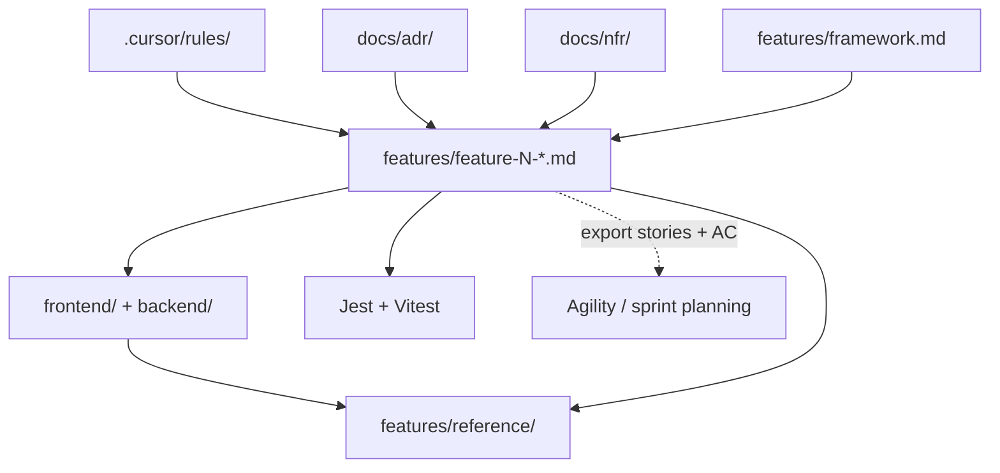

# Spec-Driven Development Framework

How Todo Speckit writes, traces, and ships **feature specifications**.  
This document is the methodology handbook; individual feature files are the requirements.

**Related:** [Feature catalog](./README.md) · [ADRs](../docs/adr/README.md) · [Quality attributes (NFRs)](../docs/nfr/README.md) · [Living reference](./reference/README.md) · [Constitution](../.cursor/rules/constitution.mdc)

---

## Purpose

Spec-Driven Development (SDD) inverts the usual order: **spec first, code second, tests as proof**.

| Role | Responsibility |
|------|----------------|
| **Feature specs** (`features/feature-N-*.md`) | Authorize *what* to build |
| **Cursor rules** (`.cursor/rules/`) | Constrain *how* to build |
| **Tests** (Jest, Vitest) | Verify spec + implementation match |
| **Reference docs** (`features/reference/`) | Snapshot *what exists now* on `dev` |
| **Quality attributes** (`docs/nfr/`) | App-wide *ilities* / NFR bars — see also [quality-attributes.mdc](../.cursor/rules/quality-attributes.mdc) (Accepted vs Deferred literacy) |
| **ADRs** (`docs/adr/`) | Record *why* cross-cutting architecture choices were made |
| **Sprints / timeboxes** (Agility, Jira, etc.) | Plan *when* work happens — **outside** these specs |

No application code may be written unless it maps to an explicit requirement in a feature file (see constitution Principle 1).

---

## Artifact map

```text
.cursor/rules/          ← stack conventions (how)
docs/adr/               ← architecture decisions (why)
docs/nfr/               ← quality attributes / ilities (bars)
features/framework.md   ← this file (process)
features/feature-N-*.md ← product requirements (what)
        ↓
frontend/ + backend/    ← implementation
        ↓
tests/                  ← verification
        ↓
features/reference/     ← integrated snapshot after merge to dev
```



**Specs define changes.** Reference files describe the current integrated product. **NFRs** in `docs/nfr/` record app-wide quality bars; feature-local bars go in **System Requirements**. **Sprints** assign stories to iterations in your agile tool; they are not fields in feature markdown.

---

## Feature spec template

Every new feature uses `features/feature-N-short-name.md` with these sections **in order**. Copy [feature-1-user-auth.md](./feature-1-user-auth.md) as the canonical example.

### Header

```markdown
# Feature: <Human-readable title>

**Feature ID:** N
**Branch pattern:** `feature/N-short-name`
**Depends on:** [Feature X — …](feature-X-….md), …   ← omit if none
**Related:** `features/reference/…`, [ADR-NNNN](../docs/adr/NNNN-title.md)   ← optional
```

- **Feature ID** — sequential integer; never reuse a retired ID.
- **Branch pattern** — one Git branch per feature, branched from `dev`, merged back to `dev` (never `main`).
- **Depends on** — link to feature files whose code must already be on `dev`.

### Required sections

| Section | Purpose |
|---------|---------|
| **User Stories** | `US-N.n` backlog items (feature N, story n) |
| **System Requirements** | Cross-cutting behavior, validation, security; feature-local NFRs (link [docs/nfr/](../docs/nfr/README.md) for app-wide bars) |
| **API Requirements** | Endpoints, payloads, status codes (if applicable) |
| **Screen Requirements** | Routes, views, UX (if applicable) |
| **Data Model Requirements** | Tables, columns, associations (if applicable) |
| **Acceptance Criteria (Gherkin)** | Testable `Given / When / Then` scenarios |
| **Test Coverage Map** | Each scenario → test file / area |
| **Out of Scope** | Explicit deferrals with links to other feature files |

Optional sections used in this repo when needed: **Data Ownership & Isolation**, **Definition of Done**, **Delivered to Feature X** (handoff notes). App-wide ilities live in [docs/nfr/quality-attributes.md](../docs/nfr/quality-attributes.md) — do not duplicate the full table in every feature.

### User story format

```markdown
### US-1.1: Short title
**As a** …
**I want to** …
**So that** …
```

Use **As a** or **As the** (for system-level stories). Number stories **`US-<feature-id>.<story-number>`** — e.g. Feature 2’s third story is `US-2.3`. Story numbers restart at `.1` in each feature file.

### Gherkin format

Group scenarios under a `###` heading that includes the **story ID** and title (same as the user story):

```markdown
### US-1.1 — Registration

#### Scenario: Descriptive name
* **Given** …
* **When** …
* **Then** …
* **And** …
```

Each `### US-N.n` block under **Acceptance Criteria** owns the scenarios for that user story. One story may have many scenarios; do not mix scenarios from different stories under one heading.

Every scenario must appear in the **Test Coverage Map** and have at least one automated test before the feature is done.

---

## Traceability

| Spec artifact | Git | Tests | Agility export |
|---------------|-----|-------|----------------|
| Feature file | `feature/N-*` branch | — | Epic (Portfolio Item) |
| `US-N.n` | — | — | Story |
| `#### Scenario:` | — | Jest / Vitest `it("…")` | Test (acceptance criteria) |
| Stable refs | — | — | `TS-F{N}-US{N}.{n}`, `TS-F{N}-AC{nnn}` |

Export backlog: `npm run agility:export` or `npm run agility:push` (see [docs/agility-import/README.md](../docs/agility-import/README.md)). Feature files matching `features/feature-N-*.md` are auto-discovered; epic titles come from `# Feature: …`.

---

## Test traceability

Tests must link back to the spec in three layers:

```text
feature-3-todo-list-item-management.md
  └── US-3.1 — Add tasks to a list
        └── Scenario: User adds a todo to the selected list
              └── backend/tests/todos.test.js → it("User adds a todo…")
```

### File header

Every feature test file starts with:

```javascript
/**
 * Feature 3 — Todo List Item Management
 * Spec: features/feature-3-todo-list-item-management.md
 */
```

Harness-only files (`app.test.js`, `App.test.js`) are exempt — they verify the test setup, not product behavior.

### Nested `describe` blocks

```javascript
describe("Feature 3 — Todo API", () => {
  describe("US-3.1 — Add tasks to a list", () => {
    it("User adds a todo to the selected list", async () => { /* … */ });
    it("User adds a todo with an empty title", async () => { /* … */ });
  });
});
```

- **Outer `describe`** — feature name (matches spec title).
- **Inner `describe`** — `US-N.n` + story title (matches AC `###` heading).
- **`it` name** — exact Gherkin **Scenario** title from the spec.

### Test Coverage Map (in each feature spec)

The map is the authoritative index. Prefer this column layout:

| Story | Scenario | Test file | Test name |
|-------|----------|-----------|-----------|
| US-3.1 | User adds a todo to the selected list | `backend/tests/todos.test.js` | `it("User adds a todo to the selected list")` |
| US-3.1 | User adds a todo with an empty title | `frontend/tests/Dashboard.test.js` | `it("User adds a todo with an empty title")` |

### Auditing coverage

```bash
# Find all tests for a story
rg "US-3.1" features/ backend/tests frontend/tests

# Find a scenario across spec and tests
rg "User adds a todo with an empty title" features/ backend/tests frontend/tests
```

Every `#### Scenario` in the spec must have ≥1 matching `it`. Every feature `it` must trace to a scenario.

---

## Architecture Decision Records (ADRs)

ADRs live in [`docs/adr/`](../docs/adr/) and answer **why** — not **what** (feature specs) or **how** (Cursor rules).

| Write an ADR when… | Use instead… |
|--------------------|--------------|
| Choosing client vs server, auth model, DB strategy | Feature spec for product behavior |
| Documenting tradeoffs and rejected alternatives | Cursor rule for ongoing patterns |
| A decision spans multiple features | Reference doc for current API/schema snapshot |

**Workflow:** propose ADR → set status `Accepted` → link from affected feature headers → encode outcome in `.cursor/rules/` if it becomes a pattern.

See [docs/adr/README.md](../docs/adr/README.md) for the template and index.

---

## Workflow per feature

### 1. Write or update the spec first

Add `features/feature-N-….md` before implementation. If behavior is not in the spec, do not implement it (or update the spec first).

### 2. Branch from `dev`

```bash
git checkout dev && git pull
git checkout -b feature/N-short-name
```

### 3. Implement in layer order

1. Backend models and associations  
2. Backend routes, controllers, authorization helpers  
3. Backend tests (Jest + supertest)  
4. Frontend services (`*Services.js`, axios client)  
5. Frontend views and components  
6. Frontend tests (Vitest + `@vue/test-utils`)  
7. Router updates and manual verification  

Work in **atomic steps** — one layer per commit when possible (constitution Principle 4).

### 4. Map tests to Gherkin

Fill the **Test Coverage Map** as you add tests. No `expect(true).toBe(true)`; use edge cases from the spec.

### 5. Merge to `dev`

When every user story is implemented and every Gherkin scenario has a test, open a PR (or merge locally) using the [Merge checklist + Agility sync](#merge-checklist--agility-sync).

```bash
git checkout dev && git merge feature/N-short-name
```

### 6. Update living reference (required when schema/API changed)

If tables or API endpoints changed, update [reference/data-model.md](./reference/data-model.md) and [reference/api.md](./reference/api.md) **in the same merge** (or immediately after). Skipping this is the most common SDD drift failure — treat it as Definition of Done, not optional cleanup.

---

## When to add vs edit

| Situation | Action |
|-----------|--------|
| New capability | New `feature-(N+1)-….md` + row in [README](./README.md) catalog |
| Cross-cutting architecture choice | New `docs/adr/NNNN-….md` + link from feature specs |
| Clarify unmerged spec | Edit the feature file in place |
| Change already on `dev` | Follow [Spec evolution after merge](#spec-evolution-after-merge) |
| “What exists now?” | Update `features/reference/` — not the feature spec alone |
| Minor UI polish (colors, spacing, button labels on an existing screen) | See [Minor UI changes](#minor-ui-changes) — usually edit rule + Screen Requirements, not a new feature |

Feature specs are **deltas**; reference docs are **current state**.

---

## Spec evolution after merge

Once a feature has merged to `dev`, treat its spec as **released history** unless the team explicitly amends it.

| Policy | Rule |
|--------|------|
| **Prefer a new delta** | New behavior, bugfix with new AC, or API/schema change → new `feature-(N+1)-….md` (or the next free ID) that describes only the change. Link **Depends on** / **Out of Scope** to the earlier feature. |
| **Amend only if unreleased** | Edit an existing `feature-N-*.md` in place when the change has **not** shipped to `dev` yet, or the team agrees the edit is a clarification (typo, clearer Gherkin) with **no** behavior change. |
| **Do not rewrite history silently** | Do not expand Feature 3’s stories after Feature 5 has shipped to “fold in” new scope — that breaks traceability and Agility refs. |
| **Agility after story/AC text changes** | Re-export or `npm run agility:push -- --feature N --upsert` when user stories or Gherkin changed. Epic/story **Reference** IDs stay stable; names/descriptions update. |
| **Reference always** | Whether you add Feature N+1 or amend, update `features/reference/` when the integrated API or schema on `dev` changed. |

**Default:** new feature file for post-merge product change; amend for pre-merge clarification only.

---

## Merge checklist + Agility sync

Before merging `feature/N-*` → `dev`:

- [ ] **Spec** — Feature file matches what shipped (stories, Screen/API/Data, Out of Scope).
- [ ] **Tests** — Every Gherkin scenario has a real `it`; Test Coverage Map complete; suites pass.
- [ ] **Living reference** — If models, columns, routes, or payloads changed: update [reference/data-model.md](./reference/data-model.md) and/or [reference/api.md](./reference/api.md) in this PR (required DoD — not optional cleanup).
- [ ] **Catalog** — [features/README.md](./README.md) row for new features; ADR links if architecture changed.
- [ ] **NFRs** — If an app-wide quality bar changed: update [docs/nfr/quality-attributes.md](../docs/nfr/quality-attributes.md) (and ADR/rule if approach or coding constraint changed).
- [ ] **Agility sync** — If stories or Gherkin changed (or this is a new feature):
  - `npm run agility:export` and/or `npm run agility:push -- --feature N --upsert`
  - New `feature-N-*.md` files are **auto-discovered** (epic title = `# Feature: …`) — no `FEATURE_FILES` edit
  - Or note “Agility deferred” with an owner

**Human review:** reject diffs that implement behavior not in the spec, or that skip reference updates when the API/schema changed.

---

## Minor UI changes

Small visual tweaks still follow SDD: update the **smallest artifact that authorizes the change**, then implement. You do **not** need a new feature file, ADR, or Agility re-export for polish alone.

### Classify first

| Kind | Examples | Update first |
|------|----------|--------------|
| **Design system** (all screens) | Theme colors, typography, default button style, `oc-cta`, spacing scale | [`.cursor/rules/ui-style-system.mdc`](../.cursor/rules/ui-style-system.mdc) → `frontend/src/plugins/vuetify.js` (and `App.vue` for global classes) |
| **Feature screen** (one view/flow) | Button placement, dialog labels, empty-state copy, layout on dashboard | **Screen Requirements** in the owning `features/feature-N-*.md` |
| **Already specified** | Spec already says “primary elevated button” — you are fixing layout to match | Code only |
| **New behavior** | New dialog, new field, changed validation or disabled rules | Feature spec + Gherkin + tests |

**Rule of thumb:** if a future developer (or AI) could not infer the correct UI from existing docs, update a spec or rule before coding.

### Workflow

1. **Classify** — design system vs feature screen vs already specified.
2. **Edit the smallest doc** — `ui-style-system.mdc` and/or **Screen Requirements** (often one to three bullets).
3. **Implement** — only the affected Vue files; follow [ui-style-system.mdc](../.cursor/rules/ui-style-system.mdc).
4. **Verify** — visual check in `npm run dev`; run `npm run test:frontend` when labels or interaction changed.
5. **Skip** — `features/reference/` (API/data only), new ADRs, new feature files, Agility push unless story/AC text changed.

### Three tiers (practical policy)

| Tier | When | Artifacts |
|------|------|-----------|
| **A — Design system** | Change applies app-wide | `ui-style-system.mdc` → `vuetify.js` / `App.vue` → sweep components if needed |
| **B — Feature screen** | Change is local to one feature’s UI | `feature-N-*.md` **Screen Requirements** → one or two `.vue` files |
| **C — Cosmetic** | Already implied by rules/spec (e.g. comfortable density) | Code only; note in commit message |

When unsure, use **Tier B** — one bullet in Screen Requirements is cheap and keeps traceability.

### What to test

| Changed | Do |
|---------|-----|
| Colors / theme / global CSS class | Visual check + hard-refresh if HMR misses `App.vue` styles |
| Button or link **label** text | Update Screen Requirements; update Vitest if Gherkin names the label |
| Layout only | Visual check; tests optional |
| Dialog flow or validation | Gherkin + Vitest |

### Cursor requests (revise UI from spec)

After you update **Screen Requirements** and/or [ui-style-system.mdc](../.cursor/rules/ui-style-system.mdc), ask Cursor to implement from the spec — not from memory.

#### Request formula

```text
Implement the UI changes in @features/feature-N-….md Screen Requirements
per @.cursor/rules/ui-style-system.mdc.

- Update only the affected Vue files (name them if you know them).
- Do not change API, backend, or behavior unless the spec says so.
- Run npm run test:frontend when labels or flows changed.
```

**Core pattern:** feature spec (what) + style rule (how) + scope guardrails.

#### What to `@`-mention

| Always | When relevant |
|--------|----------------|
| `features/feature-N-….md` | [ui-style-system.mdc](../.cursor/rules/ui-style-system.mdc) |
| | Specific `.vue` file(s) |
| | [testing-standards.mdc](../.cursor/rules/testing-standards.mdc) if tests must change |

One feature file + the style rule is usually enough — you do not need to `@` the whole repo.

#### Prompts by situation

**Screen Requirements only (most common):**

```text
I updated Screen Requirements in @features/feature-2-todo-list-management.md.

Revise the dashboard sidebar UI to match the spec:
- + New List button placement and class oc-cta
- Dialog labels Create / Cancel as written

Follow @.cursor/rules/ui-style-system.mdc.
Files: frontend/src/views/Dashboard.vue only.
No API or test changes unless Gherkin scenario text changed.
```

**Design system + feature spec:**

```text
Per @.cursor/rules/ui-style-system.mdc and
@features/feature-3-todo-list-item-management.md Screen Requirements,
apply the oc-cta button style to Add and align with Edit Profile.

Update Dashboard.vue and MenuBar.vue if needed.
Theme tokens stay in plugins/vuetify.js — no hex in components.
```

**Gherkin labels or flows changed (needs tests):**

```text
@features/feature-4-user-profile-management.md was updated:
- Screen Requirements: Edit Profile dialog layout

Implement the UI delta in MenuBar.vue.
Update frontend/tests/MenuBar.test.js if any asserted text or selectors change.
Run npm run test:frontend.
```

**One-liner:**

```text
Revise UI from @features/feature-N-….md Screen Requirements per @.cursor/rules/ui-style-system.mdc; [file.vue] only; no API changes.
```

#### Guardrails (add to any prompt)

| Phrase | Why |
|--------|-----|
| “Do not add behavior not in the spec.” | Constitution Principle 1 |
| “Do not create a new feature file.” | Polish ≠ new capability |
| “No backend changes.” | Keeps scope to UI |
| “Match exact button labels from Screen Requirements.” | Traceability to Gherkin |
| “Use `oc-cta` for primary labeled CTAs; no buttons inside `v-card-title`.” | [ui-style-system.mdc](../.cursor/rules/ui-style-system.mdc) |

#### After Cursor finishes

1. Visual check in `npm run dev` (hard-refresh if global CSS changed).
2. `npm run test:frontend` if labels, dialogs, or flows changed.
3. Confirm the diff matches **Screen Requirements** — reject extra polish the spec does not authorize.

### Do not

| Avoid | Do instead |
|-------|------------|
| Code first, spec later | Update rule or Screen Requirements first |
| New Feature N+1 for polish | Design system + existing feature screen sections |
| Put all UI guidance in a loose `design.md` with no rule | Use `ui-style-system.mdc` so Cursor applies globs on `frontend/**` |
| Nest labeled CTAs inside `<v-card-title>` | Use `<v-card-item>` `#append` — title typography skews button label size |

Optional visual references: export frames to `docs/ui/feature-N/` and link from **Screen Requirements** or the feature header **Related** line. Specs remain the functional source of truth; images are guidance only.

---

## Features vs sprints

| | Feature spec | Sprint / iteration |
|--|--------------|-------------------|
| **Question** | What must the product do? | When will the team work on it? |
| **Lives in** | `features/feature-N-*.md` | Agility, Jira, etc. |
| **Granularity** | One file per shippable capability | Any grouping of stories |
| **This repo** | Source of truth for code + tests | Assigned after export/import |

Example: Feature 2 (lists) and Feature 4 (profile) can ship in the same sprint, or Feature 3 can span two sprints — specs stay the same either way.

---

## Adding Feature N+1 (checklist)

- [ ] Pick next sequential **Feature ID** and filename `feature-N-kebab-name.md`
- [ ] Fill header: branch pattern, **Depends on** links
- [ ] Complete user stories, system/API/screen/data sections as applicable
- [ ] Write Gherkin acceptance criteria for all behavior
- [ ] Add **Test Coverage Map** before coding
- [ ] Document **Out of Scope** with links to other features
- [ ] Add row to [features/README.md](./README.md) catalog
- [ ] No Agility list edit required — `feature-N-*.md` is auto-discovered (`# Feature: …` → epic name)
- [ ] Before merge: complete the [Merge checklist + Agility sync](#merge-checklist--agility-sync)

---

## Cursor and AI usage

- Rules in `.cursor/rules/` apply automatically; they do not replace feature specs.
- In prompts, `@`-mention one feature file and **one slice** (e.g. “implement Data Model Requirements only”).
- If the AI proposes behavior not in the spec, update the spec first or reject the change (constitution Principle 6).

---

## Anti-patterns

| Do not | Do instead |
|--------|------------|
| Code first, spec later | Spec merge before or with first implementation PR |
| Put sprint numbers in feature files | Plan sprints in the agile tool |
| Skip Test Coverage Map | Map every Gherkin scenario before marking done |
| Change `reference/` without a spec | Spec authorizes the delta; reference reflects merge |
| Merge API/schema change without updating `reference/` | Same PR (or immediate follow-up) — see merge checklist |
| Amend a shipped feature to add new scope | New `feature-(N+1)` delta — see [Spec evolution after merge](#spec-evolution-after-merge) |
| Implement on `main` | `feature/N-*` → `dev` only |
| One giant “build the feature” prompt | Layer-by-layer micro-steps |

---

## Exports

| Command | Output |
|---------|--------|
| `npm run specs:pdf` | Rules + ADRs + NFRs + specs + reference → `docs/todo-speckit-specs.pdf` (auto-discovers rules, ADRs, `docs/nfr/`, `feature-N-*.md`) |
| `npm run agility:export` | CSV backlog for Agility Excel import (auto-discovers `feature-N-*.md`) |
| `npm run agility:push` | Push epics, stories, tests via Agility API |
| `npm run agility:push -- --feature N --upsert` | Update existing stories/tests for feature N; create missing |
| `npm run starter:zip` | Zip SDD starter kit for a **new** app — macOS/Windows/Linux (see [docs/STARTER-KIT.md](../docs/STARTER-KIT.md)) |

PDF and Agility both pick up new `features/feature-N-*.md` automatically. See [README](./README.md#export-rules--specs-to-pdf) and [docs/agility-import/README.md](../docs/agility-import/README.md).
