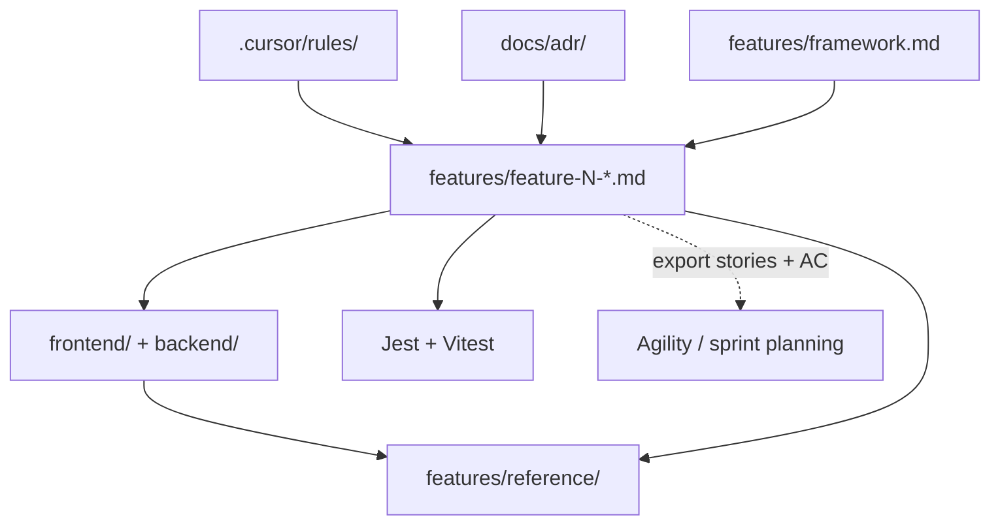

# Spec-Driven Development Framework

How Todo Speckit writes, traces, and ships **feature specifications**.  
This document is the methodology handbook; individual feature files are the requirements.

**Related:** [Feature catalog](./README.md) · [ADRs](../docs/adr/README.md) · [Living reference](./reference/README.md) · [Constitution](../.cursor/rules/constitution.mdc)

---

## Purpose

Spec-Driven Development (SDD) inverts the usual order: **spec first, code second, tests as proof**.

| Role | Responsibility |
|------|----------------|
| **Feature specs** (`features/feature-N-*.md`) | Authorize *what* to build |
| **Cursor rules** (`.cursor/rules/`) | Constrain *how* to build |
| **Tests** (Jest, Vitest) | Verify spec + implementation match |
| **Reference docs** (`features/reference/`) | Snapshot *what exists now* on `dev` |
| **ADRs** (`docs/adr/`) | Record *why* cross-cutting architecture choices were made |
| **Sprints / timeboxes** (Agility, Jira, etc.) | Plan *when* work happens — **outside** these specs |

No application code may be written unless it maps to an explicit requirement in a feature file (see constitution Principle 1).

---

## Artifact map

```text
.cursor/rules/          ← stack conventions (how)
docs/adr/               ← architecture decisions (why)
features/framework.md   ← this file (process)
features/feature-N-*.md ← product requirements (what)
        ↓
frontend/ + backend/    ← implementation
        ↓
tests/                  ← verification
        ↓
features/reference/     ← integrated snapshot after merge to dev
```



**Specs define changes.** Reference files describe the current integrated product. **Sprints** assign stories to iterations in your agile tool; they are not fields in feature markdown.

---

## Feature spec template

Every new feature uses `features/feature-N-short-name.md` with these sections **in order**. Copy [feature-1-user-auth.md](./feature-1-user-auth.md) as the canonical example.

### Header

```markdown
# Feature: <Human-readable title>

**Feature ID:** N
**Branch pattern:** `feature/N-short-name`
**Depends on:** [Feature X — …](feature-X-….md), …   ← omit if none
**Related:** `features/reference/…`, [ADR-NNNN](../docs/adr/NNNN-title.md)   ← optional
```

- **Feature ID** — sequential integer; never reuse a retired ID.
- **Branch pattern** — one Git branch per feature, branched from `dev`, merged back to `dev` (never `main`).
- **Depends on** — link to feature files whose code must already be on `dev`.

### Required sections

| Section | Purpose |
|---------|---------|
| **User Stories** | `US-N.n` backlog items (feature N, story n) |
| **System Requirements** | Cross-cutting behavior, validation, security |
| **API Requirements** | Endpoints, payloads, status codes (if applicable) |
| **Screen Requirements** | Routes, views, UX (if applicable) |
| **Data Model Requirements** | Tables, columns, associations (if applicable) |
| **Acceptance Criteria (Gherkin)** | Testable `Given / When / Then` scenarios |
| **Test Coverage Map** | Each scenario → test file / area |
| **Out of Scope** | Explicit deferrals with links to other feature files |

Optional sections used in this repo when needed: **Data Ownership & Isolation**, **Definition of Done**, **Delivered to Feature X** (handoff notes).

### User story format

```markdown
### US-1.1: Short title
**As a** …
**I want to** …
**So that** …
```

Use **As a** or **As the** (for system-level stories). Number stories **`US-<feature-id>.<story-number>`** — e.g. Feature 2’s third story is `US-2.3`. Story numbers restart at `.1` in each feature file.

### Gherkin format

Group scenarios under a `###` heading that includes the **story ID** and title (same as the user story):

```markdown
### US-1.1 — Registration

#### Scenario: Descriptive name
* **Given** …
* **When** …
* **Then** …
* **And** …
```

Each `### US-N.n` block under **Acceptance Criteria** owns the scenarios for that user story. One story may have many scenarios; do not mix scenarios from different stories under one heading.

Every scenario must appear in the **Test Coverage Map** and have at least one automated test before the feature is done.

---

## Traceability

| Spec artifact | Git | Tests | Agility export |
|---------------|-----|-------|----------------|
| Feature file | `feature/N-*` branch | — | Epic (Portfolio Item) |
| `US-N.n` | — | — | Story |
| `#### Scenario:` | — | Jest / Vitest `it("…")` | Test (acceptance criteria) |
| Stable refs | — | — | `TS-F{N}-US{N}.{n}`, `TS-F{N}-AC{nnn}` |

Export backlog: `npm run agility:export` or `npm run agility:push` (see [docs/agility-import/README.md](../docs/agility-import/README.md)).

---

## Test traceability

Tests must link back to the spec in three layers:

```text
feature-3-todo-list-item-management.md
  └── US-3.1 — Add tasks to a list
        └── Scenario: User adds a todo to the selected list
              └── backend/tests/todos.test.js → it("User adds a todo…")
```

### File header

Every feature test file starts with:

```javascript
/**
 * Feature 3 — Todo List Item Management
 * Spec: features/feature-3-todo-list-item-management.md
 */
```

Harness-only files (`app.test.js`, `App.test.js`) are exempt — they verify the test setup, not product behavior.

### Nested `describe` blocks

```javascript
describe("Feature 3 — Todo API", () => {
  describe("US-3.1 — Add tasks to a list", () => {
    it("User adds a todo to the selected list", async () => { /* … */ });
    it("User adds a todo with an empty title", async () => { /* … */ });
  });
});
```

- **Outer `describe`** — feature name (matches spec title).
- **Inner `describe`** — `US-N.n` + story title (matches AC `###` heading).
- **`it` name** — exact Gherkin **Scenario** title from the spec.

### Test Coverage Map (in each feature spec)

The map is the authoritative index. Prefer this column layout:

| Story | Scenario | Test file | Test name |
|-------|----------|-----------|-----------|
| US-3.1 | User adds a todo to the selected list | `backend/tests/todos.test.js` | `it("User adds a todo to the selected list")` |
| US-3.1 | User adds a todo with an empty title | `frontend/tests/Dashboard.test.js` | `it("User adds a todo with an empty title")` |

### Auditing coverage

```bash
# Find all tests for a story
rg "US-3.1" features/ backend/tests frontend/tests

# Find a scenario across spec and tests
rg "User adds a todo with an empty title" features/ backend/tests frontend/tests
```

Every `#### Scenario` in the spec must have ≥1 matching `it`. Every feature `it` must trace to a scenario.

---

## Architecture Decision Records (ADRs)

ADRs live in [`docs/adr/`](../docs/adr/) and answer **why** — not **what** (feature specs) or **how** (Cursor rules).

| Write an ADR when… | Use instead… |
|--------------------|--------------|
| Choosing client vs server, auth model, DB strategy | Feature spec for product behavior |
| Documenting tradeoffs and rejected alternatives | Cursor rule for ongoing patterns |
| A decision spans multiple features | Reference doc for current API/schema snapshot |

**Workflow:** propose ADR → set status `Accepted` → link from affected feature headers → encode outcome in `.cursor/rules/` if it becomes a pattern.

See [docs/adr/README.md](../docs/adr/README.md) for the template and index.

---

## Workflow per feature

### 1. Write or update the spec first

Add `features/feature-N-….md` before implementation. If behavior is not in the spec, do not implement it (or update the spec first).

### 2. Branch from `dev`

```bash
git checkout dev && git pull
git checkout -b feature/N-short-name
```

### 3. Implement in layer order

1. Backend models and associations  
2. Backend routes, controllers, authorization helpers  
3. Backend tests (Jest + supertest)  
4. Frontend services (`*Services.js`, axios client)  
5. Frontend views and components  
6. Frontend tests (Vitest + `@vue/test-utils`)  
7. Router updates and manual verification  

Work in **atomic steps** — one layer per commit when possible (constitution Principle 4).

### 4. Map tests to Gherkin

Fill the **Test Coverage Map** as you add tests. No `expect(true).toBe(true)`; use edge cases from the spec.

### 5. Merge to `dev`

When every user story is implemented and every Gherkin scenario has a test:

```bash
git checkout dev && git merge feature/N-short-name
```

### 6. Update living reference

If tables or API endpoints changed, update [reference/data-model.md](./reference/data-model.md) and [reference/api.md](./reference/api.md) at merge time.

---

## When to add vs edit

| Situation | Action |
|-----------|--------|
| New capability | New `feature-(N+1)-….md` + row in [README](./README.md) catalog |
| Cross-cutting architecture choice | New `docs/adr/NNNN-….md` + link from feature specs |
| Clarify unmerged spec | Edit the feature file in place |
| Change already on `dev` | New feature file for the delta, or amend spec only if team agrees to treat spec as living |
| “What exists now?” | Update `features/reference/` — not the feature spec alone |

Feature specs are **deltas**; reference docs are **current state**.

---

## Features vs sprints

| | Feature spec | Sprint / iteration |
|--|--------------|-------------------|
| **Question** | What must the product do? | When will the team work on it? |
| **Lives in** | `features/feature-N-*.md` | Agility, Jira, etc. |
| **Granularity** | One file per shippable capability | Any grouping of stories |
| **This repo** | Source of truth for code + tests | Assigned after export/import |

Example: Feature 2 (lists) and Feature 4 (profile) can ship in the same sprint, or Feature 3 can span two sprints — specs stay the same either way.

---

## Adding Feature N+1 (checklist)

- [ ] Pick next sequential **Feature ID** and filename `feature-N-kebab-name.md`
- [ ] Fill header: branch pattern, **Depends on** links
- [ ] Complete user stories, system/API/screen/data sections as applicable
- [ ] Write Gherkin acceptance criteria for all behavior
- [ ] Add **Test Coverage Map** before coding
- [ ] Document **Out of Scope** with links to other features
- [ ] Add row to [features/README.md](./README.md) catalog
- [ ] After merge: update `features/reference/` if schema or API changed

---

## Cursor and AI usage

- Rules in `.cursor/rules/` apply automatically; they do not replace feature specs.
- In prompts, `@`-mention one feature file and **one slice** (e.g. “implement Data Model Requirements only”).
- If the AI proposes behavior not in the spec, update the spec first or reject the change (constitution Principle 6).

---

## Anti-patterns

| Do not | Do instead |
|--------|------------|
| Code first, spec later | Spec merge before or with first implementation PR |
| Put sprint numbers in feature files | Plan sprints in the agile tool |
| Skip Test Coverage Map | Map every Gherkin scenario before marking done |
| Change `reference/` without a spec | Spec authorizes the delta; reference reflects merge |
| Implement on `main` | `feature/N-*` → `dev` only |
| One giant “build the feature” prompt | Layer-by-layer micro-steps |

---

## Who should read what

Documentation volume is intentional for SDD teaching, but not every artifact is needed for every task.

| Role / task | Read |
|-------------|------|
| Implementing a feature slice | That feature's `feature-N-*.md` only |
| Onboarding to the stack | `.cursor/rules/` + relevant ADR |
| Understanding architecture choices | `docs/adr/` |
| "What exists on `dev`?" | `features/reference/` |
| Course lead / audit bundle | Full PDF (`npm run specs:pdf`) |
| Product requirements review | Features PDF (`npm run specs:pdf:features`) |

**Rule:** specs authorize *what*; rules constrain *how*; ADRs explain *why*; reference snapshots *current state*.

---

## Exports

| Command | Output |
|---------|--------|
| `npm run specs:pdf` | **Full** — rules + ADRs + specs + reference → `docs/todo-speckit-specs.pdf` |
| `npm run specs:pdf:features` | **Features only** — catalog + framework + feature specs → `docs/todo-speckit-features.pdf` |
| `npm run specs:pdf:all` | Both PDFs above |
| `npm run agility:export` | CSV backlog for Agility Excel import |
| `npm run agility:push` | Push epics + stories + tests (full) or `--feature N` (one feature) via Agility API |

PDF include order: see [README](./README.md#export-rules--specs-to-pdf).
